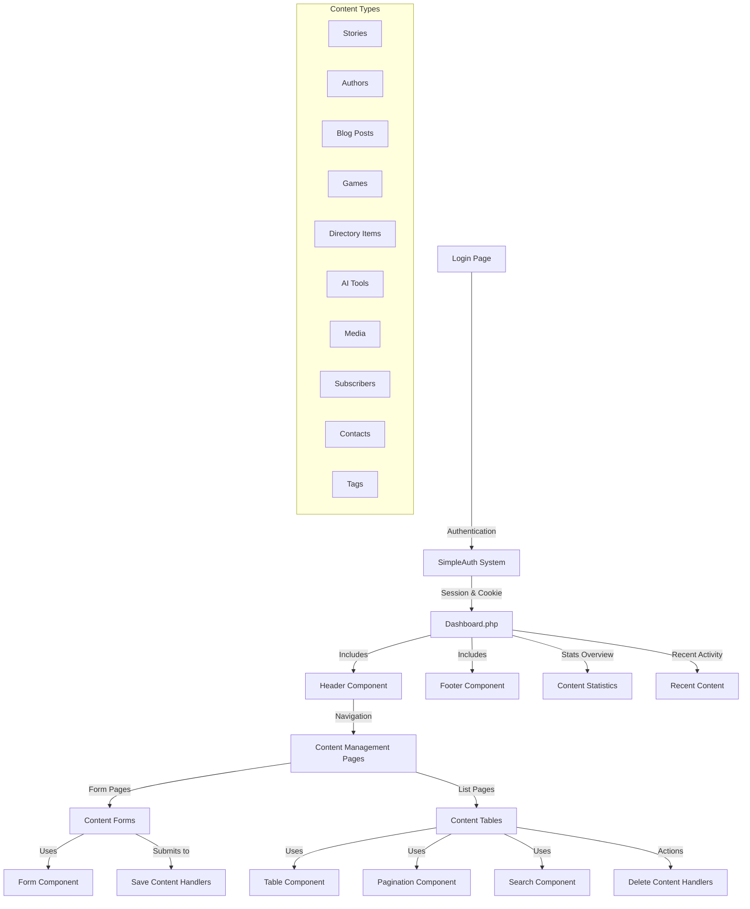

# Admin Dashboard Structure Analysis

## Overview

This document provides a comprehensive analysis of the admin dashboard structure for the Stories From The Web project. It identifies active components, potential redundant code, and provides recommendations for synchronizing the local, cPanel, and Git environments.

## Current Active Structure

The admin dashboard follows a modular component-based architecture with these key elements:

### 1. Authentication Layer
- Uses SimpleAuth (stories-backend/simple_auth.php)
- Session-based with cookie persistence
- Has database token verification

### 2. Core Files
- Main entry: stories-backend/admin/dashboard.php
- Authentication: stories-backend/admin/login.php, logout.php
- Content management pages in stories-backend/admin/content/

### 3. Reusable Components 
- Header/footer: stories-backend/admin/includes/header.php, footer.php
- Form components: stories-backend/admin/includes/form-component.php
- Table components: stories-backend/admin/includes/table-component.php
- Search/pagination: stories-backend/admin/includes/search-component.php, pagination-component.php

### 4. Content Management
The dashboard manages several content types:
- Stories
- Authors
- Blog posts
- Games
- Directory items
- AI tools
- Media
- Subscribers
- Contacts
- Tags

## Architecture Diagram

## File Structure Analysis

### Active Files
- `/stories-backend/admin/` - Main admin dashboard files
- `/stories-backend/admin/content/` - Content management pages
- `/stories-backend/admin/includes/` - Reusable components
- `/stories-backend/admin/assets/` - CSS, JS, and images

### Likely Redundant
- `/stories-backend/admin/_archive/` - Old implementations that appear archived
- `/stories-backend/admin/test_tools.php`, `test-db-connection.php` - Testing files 
- Multiple database connection files with hardcoded credentials

## Security Concerns
- Database credentials are hardcoded in multiple locations:
  - In header.php
  - In SimpleAuth.php when initialized
  - In individual content pages
- These should be consolidated into a single configuration file

## Deployment Analysis

There are multiple deployment locations:

1. **Local Development** - The workspace directory
2. **cPanel Web Server** - https://api.storiesfromtheweb.org/
3. **Git Repository** - https://github.com/OpaceDigitalAgency/stories

The cPanel deployment shows multiple folders that may contain redundant code:
- `/api.storiesfromtheweb.org/admin/` (current)
- `/api.storiesfromtheweb.org/admin-new/` (possible newer version?)
- `/api.storiesfromtheweb.org/api/` (current API)
- Multiple folders for backups, tests, docs, etc.

## Data Flow

1. **Authentication Flow**:
   - User submits credentials to login.php
   - SimpleAuth validates against the database
   - On success, creates session and cookie
   - Redirects to dashboard.php

2. **Content Management Flow**:
   - List pages (stories.php, authors.php, etc.) display content with table-component.php
   - Form pages (story-form.php, author-form.php, etc.) use form-component.php
   - Save handlers (save-story.php, save-author.php, etc.) process form submissions

## Recommendations

1. **Consolidate Configuration**
   - Create a single configuration file for database credentials
   - Move all hardcoded values to this file

2. **Clean Up Redundant Files**
   - All `_archive` folders can be safely removed
   - Duplicate test and diagnostic tools should be consolidated
   - Review `admin` vs `admin-new` to determine which is current

3. **Synchronize Environments**
   - Before a complete refresh:
     - Back up the existing cPanel deployment
     - Export the database
     - Verify which admin implementation is current
     - Ensure all changes are committed to Git

4. **Fresh Deployment Plan**
   - Create a deployment script that:
     - Excludes all `_archive` folders
     - Excludes test files
     - Properly sets file permissions
     - Updates configuration files for the target environment

5. **Security Improvements**
   - Move database credentials to environment variables or protected config
   - Implement proper access controls for admin areas
   - Add rate limiting for login attempts

## Conclusion

The admin dashboard uses a well-structured component-based architecture, but suffers from code duplication and potential security issues with hardcoded credentials. A coordinated cleanup of redundant files and synchronization across environments would significantly improve maintainability.