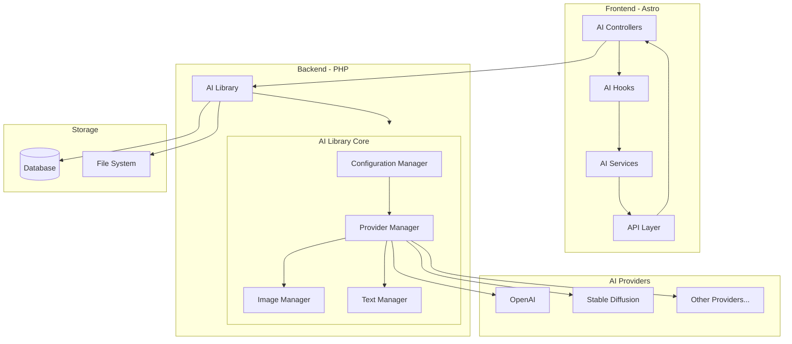

# AI Library Architecture

## Overview
This document outlines the architecture for a reusable AI library that can be used in both frontend (Astro) and backend (PHP) environments. The library is designed to be scalable, maintainable, and future-proof, with initial focus on AI image generation in the admin interface and planned support for frontend/Astro editing.

## System Architecture



## Core Architecture

### AI Library Core (PHP)
```typescript
// Core interfaces
interface AIProvider {
    name: string;
    type: 'image' | 'text' | 'audio' | 'video';
    capabilities: string[];
    config: Record<string, any>;
}

interface AIResponse<T> {
    success: boolean;
    data?: T;
    error?: string;
    metadata: {
        provider: string;
        timestamp: string;
        cost?: number;
    };
}

interface AIImageRequest {
    prompt: string;
    size?: string;
    style?: string;
    format?: string;
    variations?: number;
}
```

### Directory Structure
```
/src
├── lib/
│   ├── ai/
│   │   ├── core/
│   │   │   ├── Provider.php
│   │   │   ├── Response.php
│   │   │   └── Config.php
│   │   ├── providers/
│   │   │   ├── OpenAIProvider.php
│   │   │   └── StableDiffusionProvider.php
│   │   ├── services/
│   │   │   ├── ImageService.php
│   │   │   └── TextService.php
│   │   └── utils/
│   │       ├── Validator.php
│   │       └── ErrorHandler.php
│   └── shared/
│       └── types/
│           └── ai.ts
├── components/
│   └── ai/
│       ├── ImageGenerator.astro
│       └── TextGenerator.astro
└── api/
    └── ai/
        ├── image.php
        └── text.php
```

## Implementation Plan

### Phase 1 - Core Infrastructure
1. Create base AI library structure
2. Implement configuration management
3. Build provider management system
4. Set up error handling and logging

### Phase 2 - Image Generation
1. Implement OpenAI provider
2. Create image generation service
3. Build admin interface
4. Add image optimization and storage

### Phase 3 - Frontend Integration
1. Create shared TypeScript types
2. Build Astro components
3. Implement frontend services
4. Add caching layer

### Phase 4 - Expansion
1. Add more providers
2. Implement text generation
3. Add frontend editing capabilities
4. Build usage analytics

## Key Features

### Provider Management
- Abstract provider interface
- Easy provider switching
- Fallback providers
- Usage tracking

### Image Generation
- Multiple size options
- Style presets
- Optimization pipeline
- Variation generation

### Frontend Integration
- Type-safe API
- Reactive components
- Progress indicators
- Error handling

### Security & Performance
- Rate limiting
- Cost controls
- Result caching
- Optimization pipeline

## Database Schema

```sql
CREATE TABLE ai_providers (
    id INT PRIMARY KEY AUTO_INCREMENT,
    name VARCHAR(50) NOT NULL,
    type ENUM('image', 'text', 'audio', 'video') NOT NULL,
    config JSON,
    is_active BOOLEAN DEFAULT true,
    created_at TIMESTAMP DEFAULT CURRENT_TIMESTAMP
);

CREATE TABLE ai_generations (
    id INT PRIMARY KEY AUTO_INCREMENT,
    provider_id INT,
    type ENUM('image', 'text', 'audio', 'video') NOT NULL,
    prompt TEXT NOT NULL,
    result_url VARCHAR(255),
    metadata JSON,
    status ENUM('pending', 'completed', 'failed') NOT NULL,
    created_at TIMESTAMP DEFAULT CURRENT_TIMESTAMP,
    FOREIGN KEY (provider_id) REFERENCES ai_providers(id)
);

CREATE TABLE ai_usage (
    id INT PRIMARY KEY AUTO_INCREMENT,
    provider_id INT,
    type ENUM('image', 'text', 'audio', 'video') NOT NULL,
    cost DECIMAL(10,6),
    created_at TIMESTAMP DEFAULT CURRENT_TIMESTAMP,
    FOREIGN KEY (provider_id) REFERENCES ai_providers(id)
);