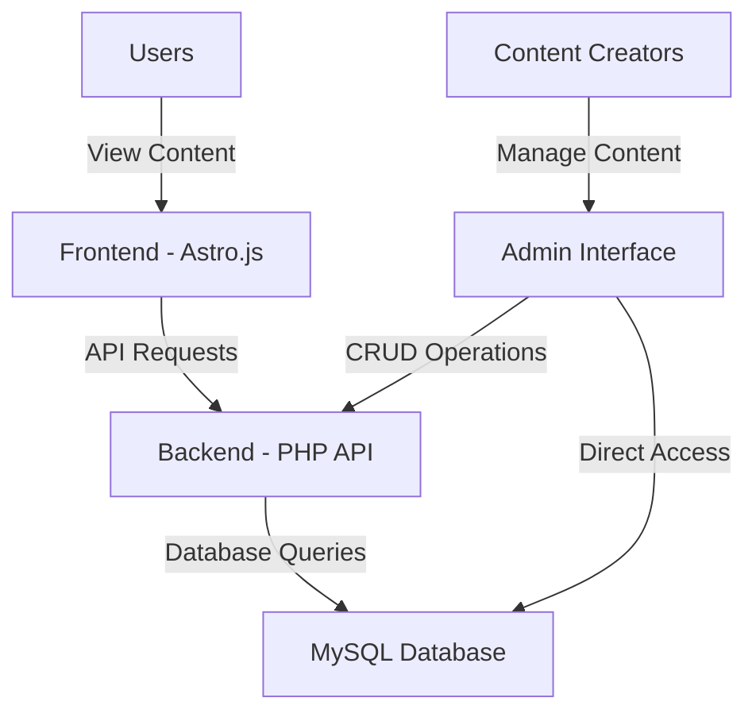
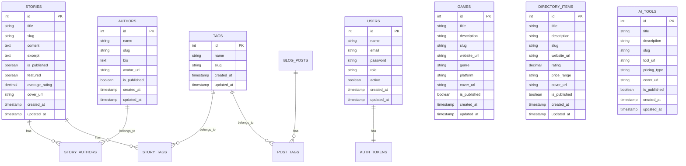
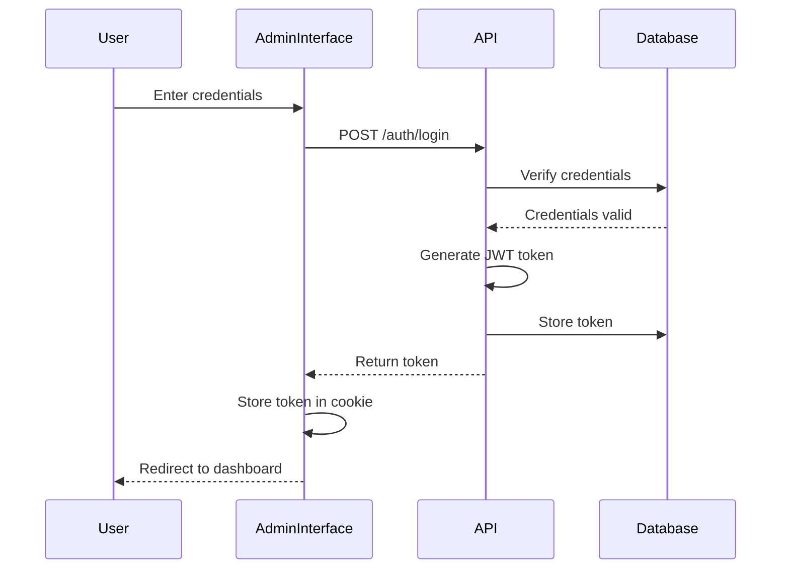
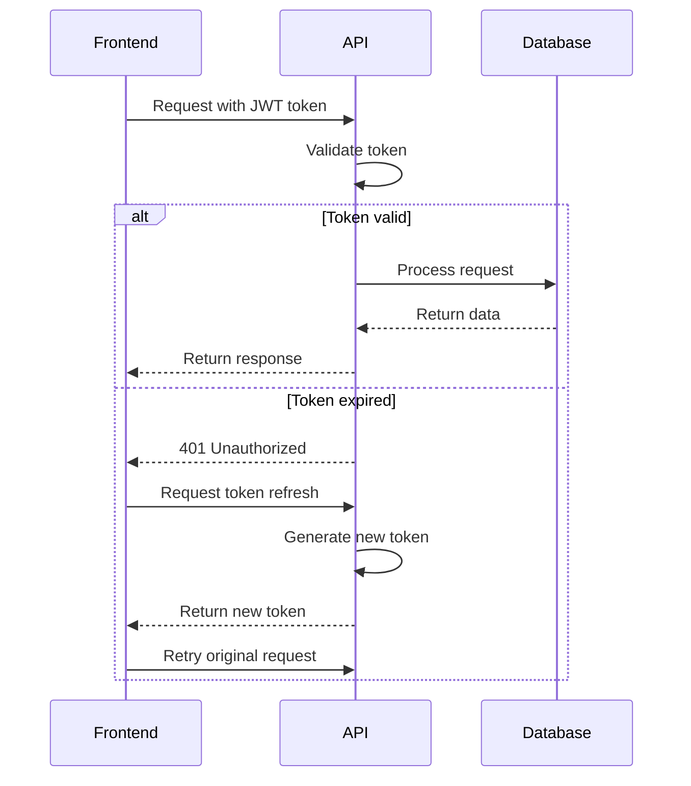
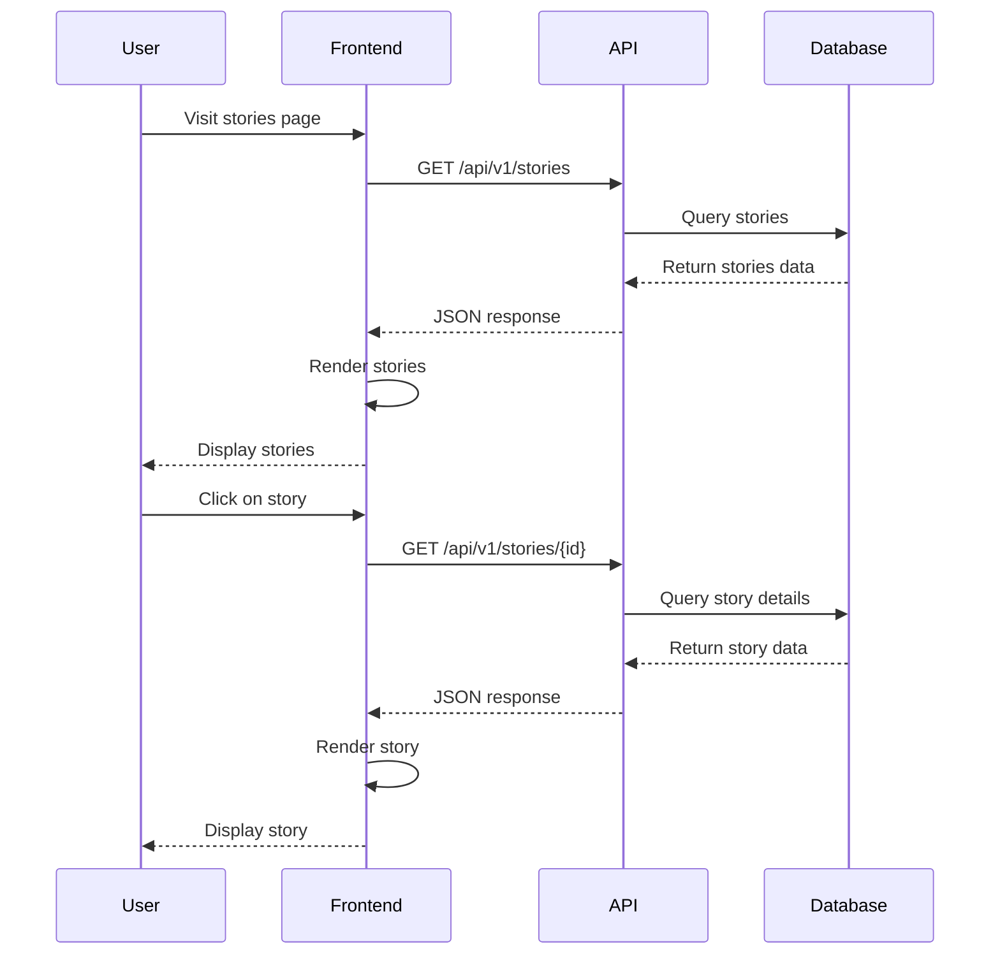
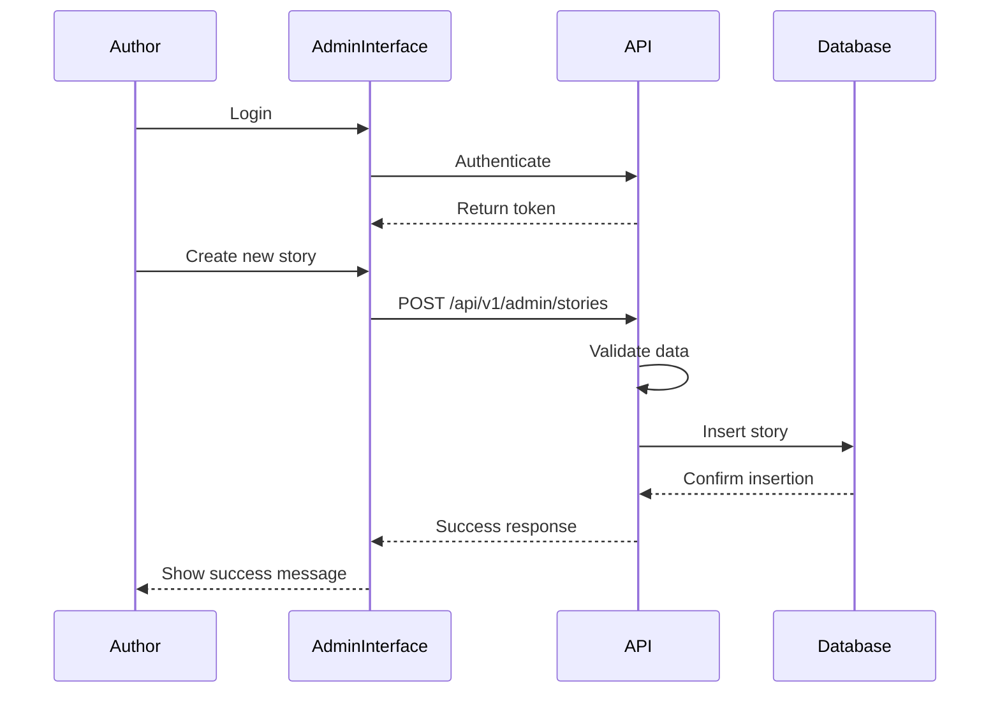
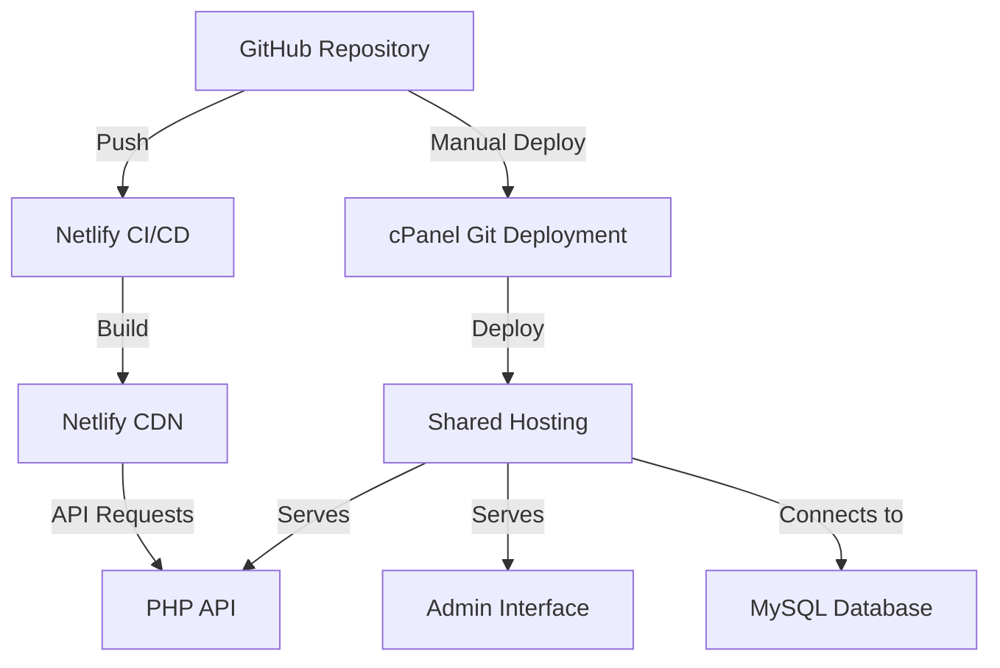

# System Architecture Documentation

This document provides a comprehensive overview of the Stories from the Web platform architecture, including system components, database schema, API endpoints, and interaction flows.

## Table of Contents

- [System Overview](#system-overview)
- [Architecture Components](#architecture-components)
- [Database Schema](#database-schema)
- [API Endpoints](#api-endpoints)
- [Authentication Flow](#authentication-flow)
- [Data Flow Diagrams](#data-flow-diagrams)
- [Deployment Architecture](#deployment-architecture)

## System Overview

Stories from the Web is a platform for sharing and discovering stories with the following key components:

- **Frontend**: Astro.js-based static site with dynamic capabilities
- **Backend API**: PHP-based RESTful API
- **Admin Interface**: PHP-based content management system
- **Database**: MySQL relational database

## Architecture Components

### High-Level Architecture

### Component Details

#### Frontend (Astro.js)
- **Purpose**: Public-facing website for users to discover and read content
- **Technology**: Astro.js, TypeScript, Tailwind CSS
- **Deployment**: Netlify (https://storiesfromtheweb.netlify.app/)
- **Key Components**:
  - Story pages
  - Author profiles
  - Game listings
  - Directory listings
  - AI tool listings
  - Blog posts

#### Backend API (PHP)
- **Purpose**: Provide data to frontend and admin interface
- **Technology**: Custom PHP framework
- **Deployment**: cPanel shared hosting
- **Key Components**:
  - RESTful endpoints
  - Authentication system
  - Data validation
  - Error handling

#### Admin Interface (PHP)
- **Purpose**: Content management for administrators and authors
- **Technology**: PHP, HTML, CSS (JavaScript-free)
- **Deployment**: Same server as Backend API
- **Key Components**:
  - Dashboard
  - Content editors
  - Media management
  - User management

#### Database (MySQL)
- **Purpose**: Store all platform content and user data
- **Technology**: MySQL 8.0
- **Deployment**: Same server as Backend API
- **Key Components**:
  - Content tables
  - User tables
  - Relationship tables
  - Authentication tables

## Database Schema

### Entity Relationship Diagram

### Table Relationships

1. **Stories to Authors** (Many-to-Many)
   - Junction table: `story_authors`
   - Fields: `story_id`, `author_id`

2. **Stories to Tags** (Many-to-Many)
   - Junction table: `story_tags`
   - Fields: `story_id`, `tag_id`

3. **Blog Posts to Tags** (Many-to-Many)
   - Junction table: `post_tags`
   - Fields: `post_id`, `tag_id`

4. **Users to Auth Tokens** (One-to-One)
   - Table: `auth_tokens`
   - Fields: `user_id`, `token`, `expires_at`

## API Endpoints

### Content Endpoints

| Endpoint | Method | Description | Response Format |
|----------|--------|-------------|-----------------|
| `/api/v1/stories` | GET | List all stories | Flat Array |
| `/api/v1/stories/{id}` | GET | Get specific story | Single Object |
| `/api/v1/authors` | GET | List all authors | Flat Array |
| `/api/v1/authors/{id}` | GET | Get specific author | Single Object |
| `/api/v1/tags` | GET | List all tags | Flat Array |
| `/api/v1/games` | GET | List all games | Flat Array |
| `/api/v1/directory-items` | GET | List all directory items | Flat Array |
| `/api/v1/ai-tools` | GET | List all AI tools | Flat Array |
| `/api/v1/blog-posts` | GET | List all blog posts | Flat Array |

### Authentication Endpoints

| Endpoint | Method | Description |
|----------|--------|-------------|
| `/api/v1/auth/login` | POST | Authenticate user and get token |
| `/api/v1/auth/logout` | POST | Invalidate current token |
| `/api/v1/auth/me` | GET | Get current user information |
| `/api/v1/auth/refresh` | POST | Refresh authentication token |

### Admin Endpoints

| Endpoint | Method | Description |
|----------|--------|-------------|
| `/api/v1/admin/stories` | POST | Create new story |
| `/api/v1/admin/stories/{id}` | PUT | Update existing story |
| `/api/v1/admin/stories/{id}` | DELETE | Delete story |
| `/api/v1/admin/media` | POST | Upload media file |
| `/api/v1/admin/media/{id}` | DELETE | Delete media file |

## Authentication Flow

### Login Process

### API Request Authentication

## Data Flow Diagrams

### Content Viewing Flow

### Content Creation Flow

## Deployment Architecture

### Production Environment

### Deployment Process

1. **Frontend Deployment**
   - Code pushed to GitHub repository
   - Netlify automatically builds and deploys
   - Static files served from Netlify CDN

2. **Backend Deployment**
   - Code pushed to GitHub repository
   - Login to cPanel
   - Use Git Version Control to pull changes
   - Deploy HEAD commit

### Environment Configuration

- **Development**: Local environment with direct file access
- **Staging**: Test deployment for verification
- **Production**: Live environment with restricted access