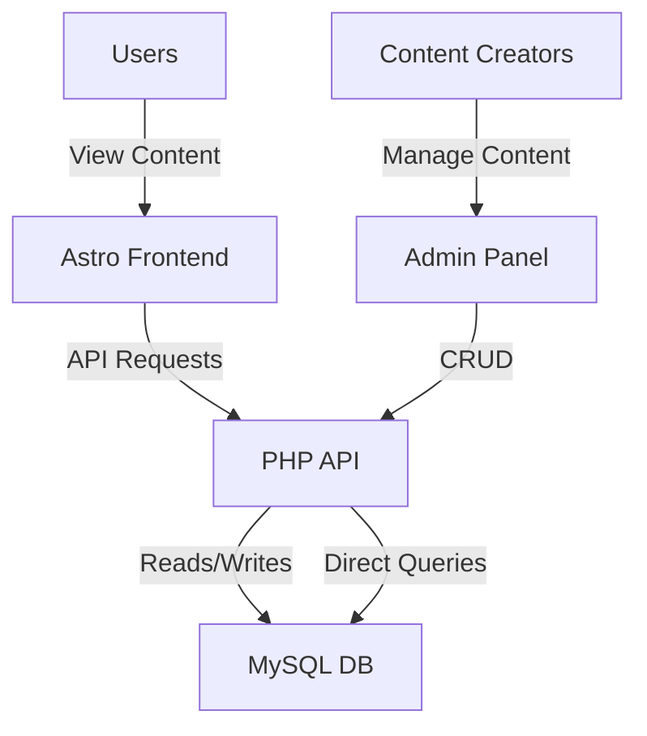

# Stories From The Web - Planning Document

## Goals
- Create a platform for sharing and discovering children's stories
- Allow filtering of stories by different categories (AI-Enhanced, Self-Published, Sponsored)
- Implement proper admin functionality for managing stories
- Establish a clean, maintainable codebase with comprehensive documentation

## Architecture Decisions

### Current Architecture
- **Frontend**: Astro.js static site with TypeScript and Tailwind CSS, deployed on Netlify CDN
- **Backend**: Custom PHP RESTful API with MySQL database, hosted on cPanel shared hosting
- **Admin Interface**: JavaScript-free PHP admin panel for content management

### Architecture Benefits
- **Separation of Concerns**: Frontend and backend can be developed independently
- **Scalability**: Each component can be scaled separately
- **Security**: Admin interface is isolated from public frontend
- **Performance**: Static frontend with dynamic data loading

### Architecture Diagram

## Constraints
- Ensure proper filtering of stories by category
- Fix form submission issues in the admin panel
- Ensure all boolean fields are properly saved
- Maintain JavaScript-free admin interface for reliability
- Standardize API response formats

## Known Issues and Solutions

### Issue 1: Same stories showing in all sections
**Problem**: All sections (AI-Enhanced, Self-Published, Sponsored) were showing the same stories.
**Solution**: Modified the API calls in `index.astro` to properly filter stories by type using query parameters.

### Issue 8: Enhanced table breaking story edit/view functionality
**Problem**: The enhanced table feature was breaking the story edit/view functionality, causing incorrect navigation when clicking view or edit buttons.
**Solution**: Fixed the match statement in enhanced-table-component.php to use the correct file paths for story view and edit actions:
- Changed 'story' => 'stories.php' to 'story' => 'view-story.php' for view actions
- Changed 'story' => 'stories.php' to 'story' => 'story-form.php' for edit actions

### Issue 2: Form saving issues
**Problem**: Certain fields like "Is Self Published" and author selection weren't saving properly.
**Solution**:
- Added explicit handling for all boolean fields in `save-story.php`
- Added debug logging for author_id to track any issues
- Ensured all form fields are properly processed

### Issue 3: Author selection not displaying correctly
**Problem**: Authors were being saved but not displayed in the stories list or when editing a story.
**Solution**:
- Modified the SQL query in `stories.php` to properly join with the authors table
- Updated the story form to display the current author when editing
- Added verification in `save-story.php` to ensure the selected author exists
- Added debug logging to track author information throughout the process

### Issue 4: "Much Loved" section criteria
**Problem**: Unclear what determines stories in the "Much Loved" section.
**Solution**: Modified the API call to sort by `average_rating` in descending order to show highest-rated stories first.

### Issue 5: Admin interface design and usability
**Problem**: The admin interface lacked a modern design and consistent user experience.
**Solution**:
- Created a modern CSS file (modern-admin.css) with a clean, professional design
- Implemented a consistent header and navigation across all admin pages
- Added view functionality for all content types
- Ensured all content types have consistent actions (view, edit, delete)
- Maintained JavaScript-free architecture as required

### Issue 6: Review system not working properly
**Problem**: Reviews weren't displaying correctly on story pages, and users couldn't submit reviews.
**Solution**:
- Fixed the RatingStars component to properly display ratings and handle interactive rating selection
- Added a slider control in the admin story form for the average_rating field
- Created a submit-review.php endpoint to handle review submissions
- Updated the reviews page to display stories with their ratings and allow users to submit reviews
- Ensured the review form properly updates the story's average rating and review count

### Issue 7: Redundant PHP scripts and fragmented documentation
**Problem**: The codebase contains numerous redundant PHP scripts and fragmented documentation.
**Solution**:
- Created a comprehensive cleanup plan (see [Revised Cleanup Plan](revised-cleanup-plan.md))
- Established a safe archiving approach for redundant files
- Consolidated documentation into a clear, organized structure
- Created visual architecture diagrams to aid understanding

## Current Cleanup Initiative

We're currently undertaking a comprehensive cleanup and documentation initiative to:

1. **Clean up redundant PHP scripts**
   - Archive obsolete fix scripts that have been incorporated into the main codebase
   - Consolidate diagnostic scripts with overlapping functionality
   - Remove backup files and temporary scripts

2. **Consolidate documentation**
   - Create a central documentation index
   - Consolidate deployment guides into a single comprehensive guide
   - Archive outdated documentation for reference
   - Create visual architecture diagrams

3. **Standardize API responses**
   - Ensure all endpoints return a consistent flat array format
   - Standardize error handling
   - Implement consistent pagination, sorting, and filtering

4. **Improve admin interface reliability**
   - Simplify the authentication system
   - Enhance form submission
   - Improve navigation and dashboard
   - Enhance media management

## Implementation Plan

The implementation will follow a phased approach:

1. **Phase 1: Preparation** (1 day)
   - Create backups
   - Set up archive directories
   - Create archive branches in Git

2. **Phase 2: PHP Scripts Cleanup** (2-3 days)
   - Archive obsolete scripts
   - Create consolidated scripts
   - Update references
   - Create script index

3. **Phase 3: Documentation Consolidation** (2-3 days)
   - Archive redundant documentation
   - Update core documentation
   - Create documentation index

4. **Phase 4: Testing and Verification** (1-2 days)
   - Test system functionality
   - Verify documentation
   - Commit and tag

For more details, see the [Revised Cleanup Plan](revised-cleanup-plan.md) and [Implementation Plan](implementation-plan.md).