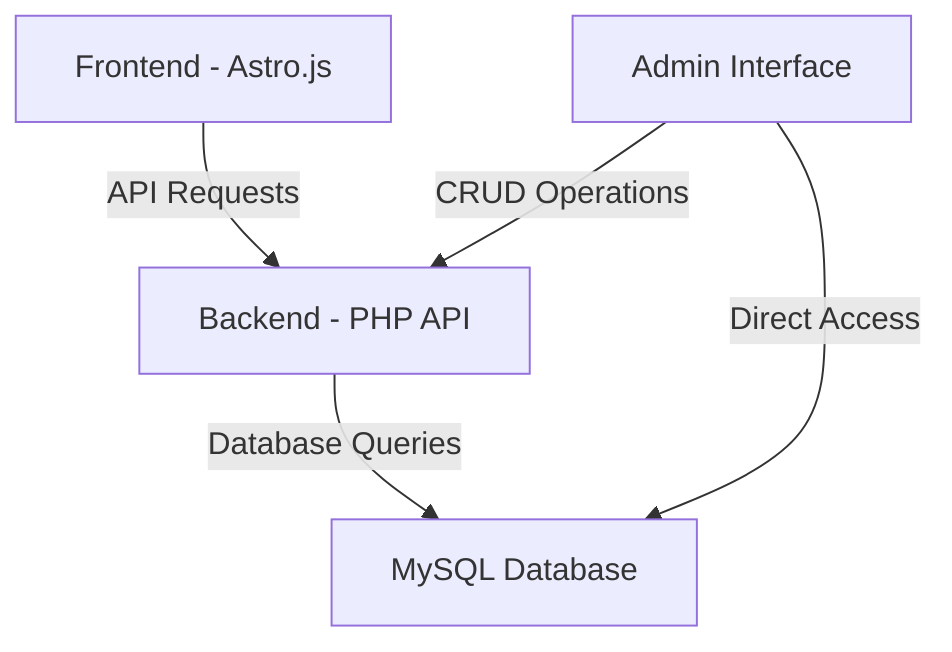
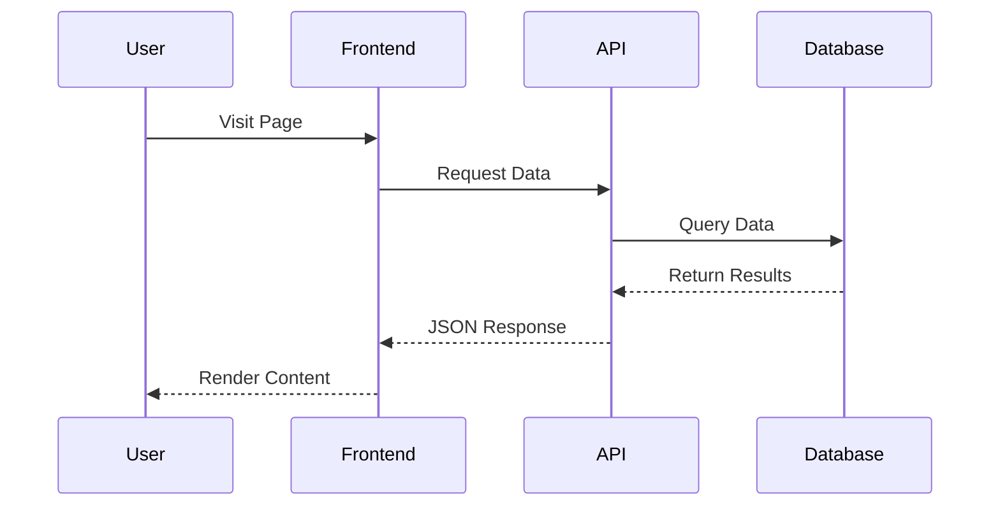
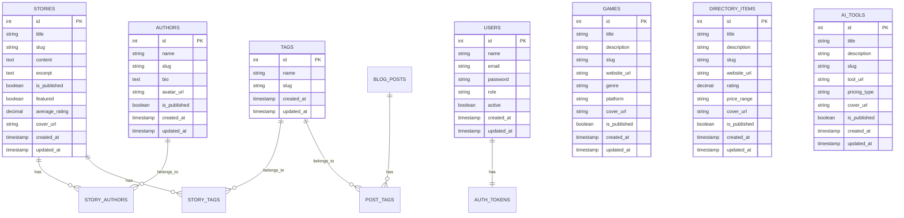

# Stories from the Web - Comprehensive Cleanup and Documentation Plan

Based on my analysis of your project, I'll outline a detailed plan to clean up the codebase, standardize the API, update documentation, and create fresh architecture diagrams. This plan will provide a clear path forward and establish a solid foundation for future development.

## 1. Current State Analysis

### 1.1 Project Structure
The project consists of two main components:
- **Frontend**: Astro.js-based website deployed on Netlify
- **Backend**: PHP-based API and admin panel with MySQL database

### 1.2 Key Issues Identified
1. **API Inconsistencies**:
   - Inconsistent response formats across endpoints
   - Missing endpoints (e.g., tags endpoint in test_api_format.php)
   - Lack of standardized error handling

2. **Admin Interface Problems**:
   - Form submission issues
   - Authentication and token refresh problems
   - JavaScript dependencies causing reliability issues

3. **Code Organization Issues**:
   - Case sensitivity problems in file paths and class names
   - Multiple fix scripts with unclear purposes
   - Outdated or incomplete documentation
   - Missing system architecture diagrams

4. **Database Structure**:
   - Inconsistent table structures
   - Missing relationships between some tables
   - Lack of clear entity relationship documentation

## 2. Cleanup and Standardization Plan

### 2.1 Backend API Standardization

#### 2.1.1 API Response Format
Standardize all API endpoints to use a consistent flat array format:

```json
[
  {
    "id": 1,
    "title": "Example Item",
    "slug": "example-item",
    "other_fields": "values"
  },
  {
    "id": 2,
    "title": "Another Item",
    "slug": "another-item",
    "other_fields": "values"
  }
]
```

#### 2.1.2 API Endpoints to Standardize
1. `/api/v1/stories`
2. `/api/v1/authors`
3. `/api/v1/tags` (currently missing)
4. `/api/v1/games`
5. `/api/v1/directory-items`
6. `/api/v1/ai-tools`
7. `/api/v1/blog-posts`

#### 2.1.3 Error Response Format
Standardize error responses:

```json
{
  "error": {
    "status": 404,
    "message": "Resource not found"
  }
}
```

### 2.2 PHP Scripts Cleanup

#### 2.2.1 Scripts to Keep (Diagnostic/Useful)
1. `api_diagnostic.php` - Useful for testing API endpoints
2. `test_api_format.php` - Helps verify API response formats
3. `check_auth_status.php` - Useful for authentication debugging
4. `case_sensitivity_scan.php` - Helps identify case sensitivity issues
5. `test_database.php` - Useful for database connection testing

#### 2.2.2 Scripts to Remove (Obsolete/Redundant)
1. All temporary fix scripts with "fix_" prefix that have been incorporated
2. Duplicate diagnostic scripts
3. Outdated deployment scripts
4. Backup files with .bak or .orig extensions

### 2.3 Admin Interface Improvements

#### 2.3.1 Authentication System
1. Simplify the authentication flow
2. Ensure consistent token storage
3. Implement proper token refresh mechanism

#### 2.3.2 Form Submission
1. Standardize form submission process
2. Improve error handling and feedback
3. Ensure consistent data validation

## 3. Documentation Updates

### 3.1 System Architecture Documentation

#### 3.1.1 High-Level Architecture Diagram


#### 3.1.2 Component Interaction Diagram


### 3.2 Database Documentation

#### 3.2.1 Entity Relationship Diagram


### 3.3 API Documentation

#### 3.3.1 API Endpoints Table
| Endpoint | Method | Description | Response Format |
|----------|--------|-------------|-----------------|
| `/api/v1/stories` | GET | List all stories | Flat Array |
| `/api/v1/stories/{id}` | GET | Get specific story | Single Object |
| `/api/v1/authors` | GET | List all authors | Flat Array |
| `/api/v1/authors/{id}` | GET | Get specific author | Single Object |
| `/api/v1/tags` | GET | List all tags | Flat Array |
| `/api/v1/games` | GET | List all games | Flat Array |
| `/api/v1/directory-items` | GET | List all directory items | Flat Array |
| `/api/v1/ai-tools` | GET | List all AI tools | Flat Array |
| `/api/v1/blog-posts` | GET | List all blog posts | Flat Array |

#### 3.3.2 Authentication Endpoints
| Endpoint | Method | Description |
|----------|--------|-------------|
| `/api/v1/auth/login` | POST | Authenticate user and get token |
| `/api/v1/auth/logout` | POST | Invalidate current token |
| `/api/v1/auth/me` | GET | Get current user information |
| `/api/v1/auth/refresh` | POST | Refresh authentication token |

## 4. Implementation Plan

### 4.1 Phase 1: Cleanup and Analysis
1. **Audit existing PHP scripts**
   - Categorize scripts as "keep", "remove", or "consolidate"
   - Document the purpose of scripts to keep
   - Create a list of scripts to be removed

2. **Analyze API endpoints**
   - Test all endpoints for response format consistency
   - Identify missing endpoints
   - Document current behavior

3. **Review database schema**
   - Verify table structures match documentation
   - Identify any missing relationships
   - Document current schema

### 4.2 Phase 2: API Standardization
1. **Update API response formats**
   - Modify `/api/v1/api.php` to ensure consistent flat array responses
   - Add missing endpoints (e.g., tags)
   - Standardize error handling

2. **Create comprehensive API tests**
   - Develop test scripts for all endpoints
   - Verify response formats
   - Test error handling

### 4.3 Phase 3: Admin Interface Improvements
1. **Simplify authentication system**
   - Ensure consistent token handling
   - Implement proper token refresh
   - Improve error feedback

2. **Enhance form submission**
   - Standardize form processing
   - Improve validation and error handling
   - Ensure consistent behavior across all content types

### 4.4 Phase 4: Documentation Creation
1. **Create system architecture documentation**
   - High-level architecture diagrams
   - Component interaction diagrams
   - Deployment flow diagrams

2. **Update database documentation**
   - Entity relationship diagrams
   - Table structure documentation
   - Relationship explanations

3. **Create comprehensive API documentation**
   - Endpoint documentation
   - Request/response format examples
   - Authentication flow documentation

## 5. Maintenance and Future Development Guidelines

### 5.1 Code Organization Standards
1. **File and Directory Naming**
   - Consistent capitalization (e.g., Core/, Endpoints/, etc.)
   - Clear naming conventions
   - Proper directory structure

2. **Code Style Guidelines**
   - PSR-4 autoloading compliance
   - Consistent formatting
   - Proper documentation

### 5.2 Development Workflow
1. **Feature Development Process**
   - Requirements documentation
   - Implementation plan
   - Testing strategy
   - Documentation updates

2. **Testing Guidelines**
   - API endpoint testing
   - Admin interface testing
   - Frontend integration testing

### 5.3 Documentation Maintenance
1. **Documentation Update Process**
   - When to update documentation
   - How to update diagrams
   - Documentation review process

## 6. Conclusion and Next Steps

This comprehensive plan addresses the key issues in your Stories from the Web platform and provides a clear path forward. By implementing these changes, you'll establish a solid foundation for future development and avoid the recurring issues that have been causing frustration.

The next steps would be to:
1. Review and approve this plan
2. Prioritize the implementation phases
3. Begin with Phase 1 (Cleanup and Analysis)
4. Proceed through the remaining phases systematically