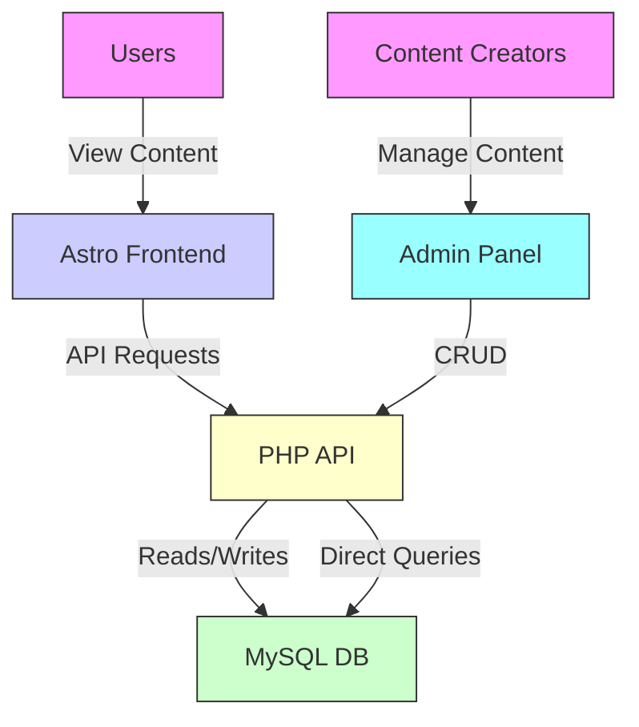
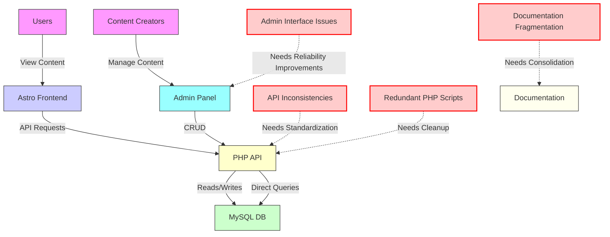
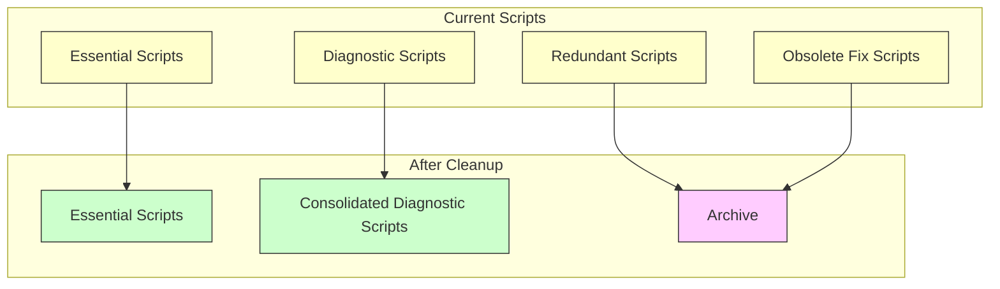
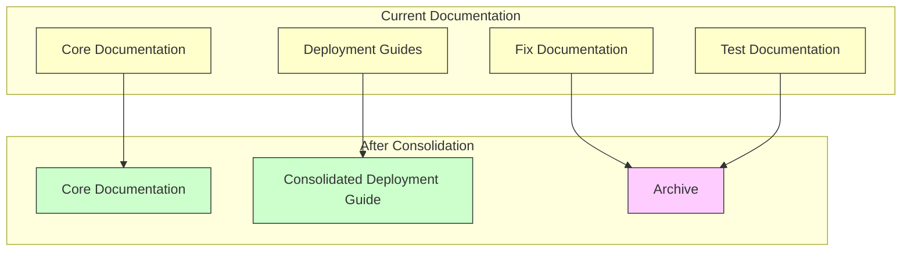
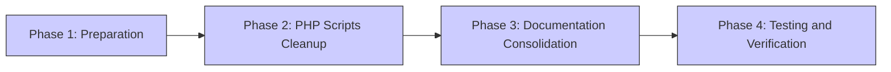
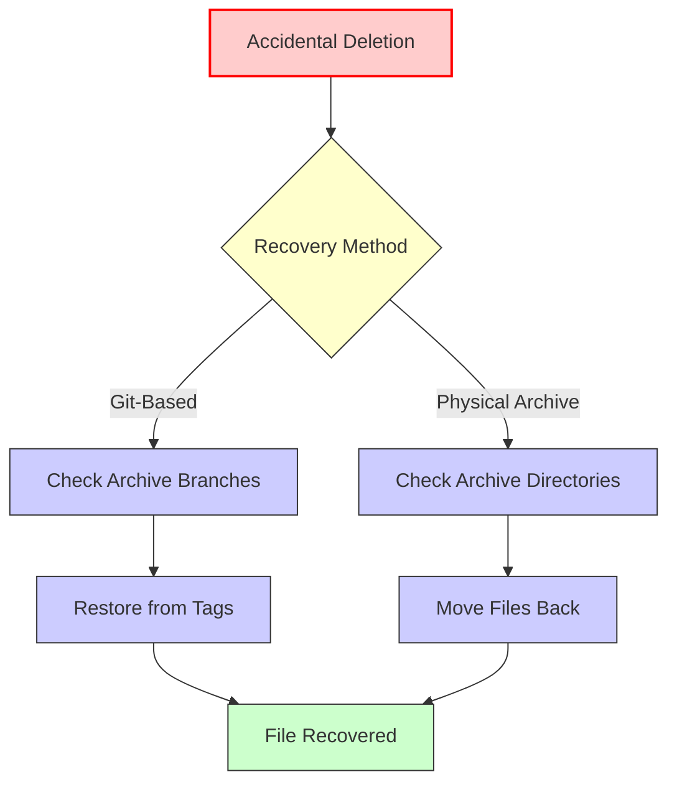

# Stories from the Web - System Architecture with Improvement Areas

This document provides a visual representation of the current system architecture and highlights the areas that need improvement as part of the cleanup and standardization plan.

## Current Architecture Overview

## Areas Needing Improvement

## PHP Scripts Organization

## Documentation Organization

## Implementation Phases

## Recovery Strategy

## Conclusion

This visual representation of the Stories from the Web architecture highlights the key areas that need improvement as part of the cleanup and standardization plan. By addressing these areas, we'll create a more maintainable, reliable, and well-documented codebase that will serve as a solid foundation for future development.

The implementation plan outlined in the [Revised Cleanup Plan](revised-cleanup-plan.md) provides a step-by-step approach to addressing these improvement areas while ensuring that we can quickly recover if something gets moved or deleted by accident.