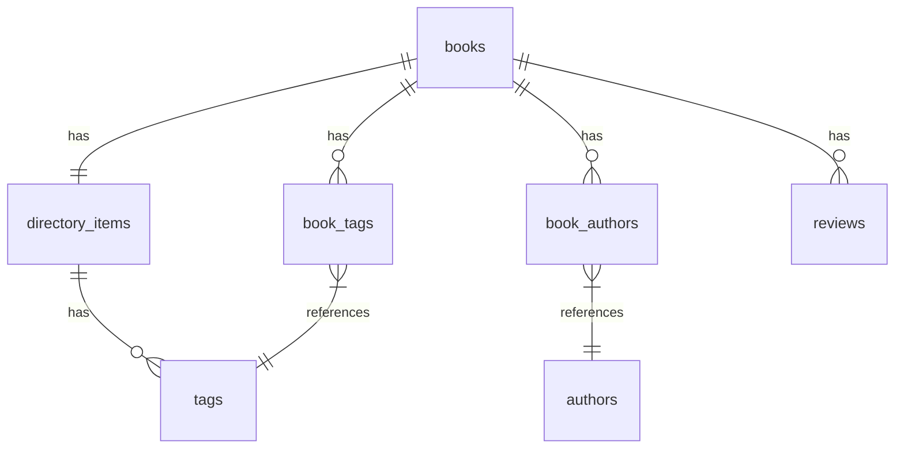
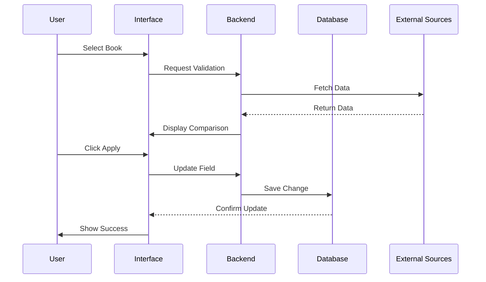

# Book Validation System Enhancement Plan

## UI Mockup

```
+----------------------------------------------------------------------------------------+
|                               Book Validation Interface                                  |
+----------------------------------------------------------------------------------------+
| Current Book: Holes by Louis Sachar                                                     |
| Status: ✅ Found in 3 sources                                                           |
+----------------------------------------------------------------------------------------+

+----------------+------------------+------------------+------------------+----------------+
| Field          | Current Value    | Google Books     | Open Library     | Goodreads     |
+----------------+------------------+------------------+------------------+----------------+
| Title          | Holes            | Holes            | Holes            | Holes         |
|                |                  | [Apply] ✓        | [Apply] ✓        | [Apply] ✓     |
+----------------+------------------+------------------+------------------+----------------+
| Author         | Louis Sachar     | Louis Sachar     | Louis Sachar     | Louis Sachar  |
|                |                  | [Apply] ✓        | [Apply] ✓        | [Apply] ✓     |
+----------------+------------------+------------------+------------------+----------------+
| ISBN-10        | Not available    | 0440414806       | 0440414806       | N/A           |
|                |                  | [Apply] 🔄       | [Apply] 🔄       | [-]           |
+----------------+------------------+------------------+------------------+----------------+
| ISBN-13        | 978-0440414803   | 9780440414803    | 9780440414803    | N/A           |
|                |                  | [Apply] ✓        | [Apply] ✓        | [-]           |
+----------------+------------------+------------------+------------------+----------------+
| Publisher      | Yearling         | Yearling         | Dell Yearling    | Yearling      |
|                |                  | [Apply] ✓        | [Apply] ⚠️       | [Apply] ✓     |
+----------------+------------------+------------------+------------------+----------------+
| Pub Date       | Not available    | 2000-05-09       | 2000             | Aug 20, 1998  |
|                |                  | [Apply] 🔄       | [Apply] 🔄       | [Apply] 🔄    |
+----------------+------------------+------------------+------------------+----------------+
| Pages          | Not available    | 246              | 233              | 5             |
|                |                  | [Apply] 🔄       | [Apply] 🔄       | [Apply] ❌    |
+----------------+------------------+------------------+------------------+----------------+
| Language       | Not available    | English          | English          | English       |
|                |                  | [Apply] 🔄       | [Apply] 🔄       | [Apply] 🔄    |
+----------------+------------------+------------------+------------------+----------------+
| Format         | Not available    | Paperback        | Paperback        | Mass Market   |
|                |                  | [Apply] 🔄       | [Apply] 🔄       | [Apply] ⚠️    |
+----------------+------------------+------------------+------------------+----------------+
| Series         | Not available    | N/A              | N/A              | Holes Series #1|
|                |                  | [-]              | [-]              | [Apply] 🔄    |
+----------------+------------------+------------------+------------------+----------------+
| Awards         | Not available    | Newbery Medal    | N/A              | Newbery Medal |
|                |                  | [Apply] 🔄       | [-]              | [Apply] 🔄    |
+----------------+------------------+------------------+------------------+----------------+
| Characters     | Not available    | N/A              | N/A              | Stanley       |
|                |                  | [-]              | [-]              | Zero          |
|                |                  |                  |                  | [Apply] 🔄    |
+----------------+------------------+------------------+------------------+----------------+
| Settings       | Not available    | N/A              | N/A              | Camp Green    |
|                |                  | [-]              | [-]              | Lake          |
|                |                  |                  |                  | [Apply] 🔄    |
+----------------+------------------+------------------+------------------+----------------+
| Subjects       | Not available    | Juvenile Fiction | Young Adult      | Young Adult   |
|                |                  | Friendship       | Fiction          | Fiction       |
|                |                  | Adventure        | Adventure        | Adventure     |
|                |                  | [Apply] 🔄       | [Apply] 🔄       | [Apply] 🔄    |
+----------------+------------------+------------------+------------------+----------------+
| Preview Link   | Not available    | [View] 🔗        | [View] 🔗        | N/A           |
|                |                  | [Apply] 🔄       | [Apply] 🔄       | [-]           |
+----------------+------------------+------------------+------------------+----------------+
| Cover Image    | [Current]        | [Preview]        | [Preview]        | [Preview]     |
|                |                  | [Apply] 🔄       | [Apply] 🔄       | [Apply] 🔄    |
+----------------+------------------+------------------+------------------+----------------+
| Rating         | Not available    | 4.5/5            | N/A              | 4.13/5        |
|                |                  | [Apply] 🔄       | [-]              | [Apply] 🔄    |
+----------------+------------------+------------------+------------------+----------------+
| Rating Count   | Not available    | 1,234            | N/A              | 987,654       |
|                |                  | [Apply] 🔄       | [-]              | [Apply] 🔄    |
+----------------+------------------+------------------+------------------+----------------+
| Review Count   | Not available    | 234              | N/A              | 45,678        |
|                |                  | [Apply] 🔄       | [-]              | [Apply] 🔄    |
+----------------+------------------+------------------+------------------+----------------+
| Maturity       | Not available    | Ages 10-12       | Young Adult      | Ages 10+      |
| Rating         |                  | [Apply] 🔄       | [Apply] 🔄       | [Apply] 🔄    |
+----------------+------------------+------------------+------------------+----------------+

Legend:
✓ - Matches current value
🔄 - New value available
⚠️ - Conflict with other sources
❌ - Likely incorrect value
[-] - No data available

Global Actions:
[Apply All Valid] [Apply All from Google Books] [Apply All from Open Library] [Apply All from Goodreads]
[Reset All] [Validate Again] [Export Changes]

+----------------------------------------------------------------------------------------+
|                               Validation History                                         |
+----------------------------------------------------------------------------------------+
| 2025-05-20 12:58:23 - Updated ISBN-10 from Google Books                                |
| 2025-05-20 12:58:23 - Updated Publisher from Goodreads                                 |
| 2025-05-20 12:58:24 - Updated Page Count from Google Books                             |
| 2025-05-20 12:58:24 - Updated Series info from Goodreads                               |
+----------------------------------------------------------------------------------------+
```

## Database Schema and Relationships

### Core Tables

```sql
-- Books table (main table for book data)
CREATE TABLE books (
    directory_item_id INT PRIMARY KEY,
    title VARCHAR(255) DEFAULT NULL,
    isbn VARCHAR(20) DEFAULT NULL,
    isbn13 VARCHAR(20) DEFAULT NULL,
    author VARCHAR(255) DEFAULT NULL,
    publisher VARCHAR(255) DEFAULT NULL,
    publication_date DATE DEFAULT NULL,
    page_count INT DEFAULT NULL,
    price_range VARCHAR(20) DEFAULT NULL,
    age_range VARCHAR(50) DEFAULT NULL,
    reading_level VARCHAR(50) DEFAULT NULL,
    language VARCHAR(50) DEFAULT NULL,
    format VARCHAR(50) DEFAULT NULL,
    cover_url VARCHAR(255) DEFAULT NULL,
    purchase_links JSON DEFAULT NULL,
    preview_link VARCHAR(255) DEFAULT NULL,
    metadata JSON DEFAULT NULL,
    series VARCHAR(255) DEFAULT NULL,
    publisher_id INT DEFAULT NULL,
    internet_archive_id VARCHAR(100) DEFAULT NULL,
    awards TEXT DEFAULT NULL,
    characters TEXT DEFAULT NULL,
    settings TEXT DEFAULT NULL,
    last_validated TIMESTAMP DEFAULT NULL,
    validation_status ENUM('pending', 'valid', 'invalid', 'partial') DEFAULT 'pending',
    FOREIGN KEY (directory_item_id) REFERENCES directory_items(id),
    FOREIGN KEY (publisher_id) REFERENCES publishers(id),
    INDEX idx_isbn (isbn),
    INDEX idx_isbn13 (isbn13),
    INDEX idx_internet_archive_id (internet_archive_id)
);

-- Directory Items table (parent table for all content types)
CREATE TABLE directory_items (
    id INT PRIMARY KEY AUTO_INCREMENT,
    title VARCHAR(255) NOT NULL,
    description TEXT,
    category_id INT,
    slug VARCHAR(255) NOT NULL,
    published_at DATETIME,
    website_url VARCHAR(255),
    contact_email VARCHAR(255),
    contact_phone VARCHAR(255),
    address TEXT,
    featured TINYINT(1) DEFAULT 0,
    price_range VARCHAR(50),
    cover_url VARCHAR(255),
    is_published TINYINT(1) DEFAULT 0,
    created_at DATETIME DEFAULT CURRENT_TIMESTAMP,
    updated_at DATETIME DEFAULT CURRENT_TIMESTAMP ON UPDATE CURRENT_TIMESTAMP,
    story_id INT,
    type VARCHAR(50) DEFAULT 'general',
    review_count INT DEFAULT 0,
    average_rating DECIMAL(3,2),
    highest_rating DECIMAL(3,2),
    lowest_rating DECIMAL(3,2),
    ai_summary TEXT,
    suitability_score DECIMAL(3,2),
    content_flags JSON,
    UNIQUE INDEX idx_slug (slug),
    INDEX idx_type (type)
);

-- Book Authors junction table
CREATE TABLE book_authors (
    id INT PRIMARY KEY AUTO_INCREMENT,
    directory_item_id INT NOT NULL,
    author_id INT NOT NULL,
    role VARCHAR(50) DEFAULT 'author',
    created_at TIMESTAMP DEFAULT CURRENT_TIMESTAMP,
    updated_at TIMESTAMP DEFAULT CURRENT_TIMESTAMP ON UPDATE CURRENT_TIMESTAMP,
    FOREIGN KEY (directory_item_id) REFERENCES directory_items(id),
    FOREIGN KEY (author_id) REFERENCES authors(id),
    UNIQUE KEY unique_book_author (directory_item_id, author_id)
);

-- Authors table
CREATE TABLE authors (
    id INT PRIMARY KEY AUTO_INCREMENT,
    name VARCHAR(255) NOT NULL,
    bio TEXT,
    website VARCHAR(255),
    photo_url VARCHAR(255),
    social_links JSON,
    created_at TIMESTAMP DEFAULT CURRENT_TIMESTAMP,
    updated_at TIMESTAMP DEFAULT CURRENT_TIMESTAMP ON UPDATE CURRENT_TIMESTAMP
);

-- Tags table (for genres and categories)
CREATE TABLE tags (
    id INT PRIMARY KEY AUTO_INCREMENT,
    name VARCHAR(255) NOT NULL,
    slug VARCHAR(255) NOT NULL,
    type VARCHAR(50) DEFAULT 'genre',
    parent_id INT DEFAULT NULL,
    created_at TIMESTAMP DEFAULT CURRENT_TIMESTAMP,
    updated_at TIMESTAMP DEFAULT CURRENT_TIMESTAMP ON UPDATE CURRENT_TIMESTAMP,
    FOREIGN KEY (parent_id) REFERENCES tags(id),
    UNIQUE INDEX idx_slug (slug)
);

-- Book Tags junction table
CREATE TABLE book_tags (
    directory_item_id INT NOT NULL,
    tag_id INT NOT NULL,
    PRIMARY KEY (directory_item_id, tag_id),
    FOREIGN KEY (directory_item_id) REFERENCES directory_items(id),
    FOREIGN KEY (tag_id) REFERENCES tags(id)
);

-- Reviews table
CREATE TABLE reviews (
    id INT PRIMARY KEY AUTO_INCREMENT,
    book_id INT NOT NULL,
    source_id INT NOT NULL,
    reviewer_name VARCHAR(255),
    reviewer_age TINYINT UNSIGNED,
    review_date DATE,
    original_rating VARCHAR(50),
    rating_value DECIMAL(10,2),
    rating_scale DECIMAL(10,2),
    rating_normalised DECIMAL(3,2),
    review_text TEXT,
    metadata JSON,
    ai_summary TEXT,
    suitability_score DECIMAL(3,2),
    content_flags JSON,
    created_at TIMESTAMP DEFAULT CURRENT_TIMESTAMP,
    updated_at TIMESTAMP DEFAULT CURRENT_TIMESTAMP ON UPDATE CURRENT_TIMESTAMP,
    FOREIGN KEY (book_id) REFERENCES books(directory_item_id),
    FOREIGN KEY (source_id) REFERENCES review_sources(id)
);
```

### Entity Relationship Diagram



## Implementation Plan

### 1. Database Updates

```sql
-- Already implemented in previous SQL
ALTER TABLE books
  ADD COLUMN language VARCHAR(50) DEFAULT NULL,
  ADD COLUMN format VARCHAR(50) DEFAULT NULL,
  ADD COLUMN preview_link VARCHAR(255) DEFAULT NULL,
  ADD COLUMN internet_archive_id VARCHAR(100) DEFAULT NULL,
  ADD COLUMN awards TEXT DEFAULT NULL,
  ADD COLUMN characters TEXT DEFAULT NULL,
  ADD COLUMN settings TEXT DEFAULT NULL,
  ADD COLUMN maturity_rating VARCHAR(50) DEFAULT NULL,
  ADD COLUMN rating DECIMAL(3,2) DEFAULT NULL,
  ADD COLUMN rating_count INT DEFAULT NULL,
  ADD COLUMN review_count INT DEFAULT NULL,
  ADD COLUMN validation_status ENUM('pending', 'valid', 'invalid', 'partial') DEFAULT 'pending',
  ADD COLUMN last_validated TIMESTAMP NULL;
```

### 2. Component Structure

```
book-import-validate/
├── templates/
│   ├── validation-interface.php      # Main interface template
│   ├── source-comparison-table.php   # Table component
│   └── field-controls.php           # Individual field controls
├── js/
│   ├── validation.js                # Main validation logic
│   ├── field-updater.js            # Field update handlers
│   └── ui-components.js            # UI components
└── css/
    ├── validation-interface.css     # Main styles
    └── comparison-table.css        # Table-specific styles
```

### 3. Key Features

#### Field-Level Updates
```javascript
// field-updater.js
async function updateField(bookId, field, value, source) {
  try {
    const response = await fetch('/api/books/update-field', {
      method: 'POST',
      body: JSON.stringify({ bookId, field, value, source })
    });

    if (response.ok) {
      updateUIStatus(field, 'success');
      logChange(field, value, source);
    }
  } catch (error) {
    handleError(error);
  }
}
```

#### Visual Feedback
```css
/* comparison-table.css */
.field-match { background: #e8f5e9; }
.field-new { background: #fff3e0; }
.field-conflict { background: #ffebee; }
.field-empty { background: #f5f5f5; }

.apply-button {
  padding: 2px 8px;
  border-radius: 4px;
  font-size: 12px;
}

.apply-button.available { background: #4caf50; }
.apply-button.conflict { background: #ff9800; }
.apply-button.invalid { background: #f44336; }
```

### 4. API Endpoints

```php
// Book validation endpoints
POST /api/books/validate/{id}
POST /api/books/update-field/{id}
GET  /api/books/validation-status/{id}
GET  /api/books/source-data/{id}
POST /api/books/apply-all/{id}
POST /api/books/reset/{id}
```

### 5. Validation Flow



### 6. Error Handling

- Field-level validation
- Source reliability scoring
- Conflict resolution
- Update history tracking
- Undo capability
- Data format validation
- API error recovery
- Rate limiting protection

### 7. Performance Considerations

- Lazy loading of source data
- Caching of validation results
- Batch update capability
- Asynchronous validation
- Image optimization
- Response compression
- Database query optimization

## Implementation Status

The Book Validation System has been implemented with the following components:

### Database Updates
- Added new columns to the books table for enhanced metadata
- Created validation_cache table for caching validation results
- Added validation_history table for tracking changes

### Component Structure
The system follows a modular approach with these components:

```
book-import-validate/
├── functions/
│   ├── validation-functions.php       # Main validation functions
│   ├── google-books-validation-functions.php  # Google Books API integration
│   ├── open-library-validation-functions.php  # Open Library API integration
│   ├── goodreads-validation-functions.php     # Goodreads data extraction
│   ├── cache-functions.php            # Caching and history functions
│   ├── book-update-functions.php      # Book data update functions
│   └── search-functions.php           # Search and suggestion functions
├── templates/
│   ├── validation-interface.php       # Main interface template
│   ├── source-comparison-table.php    # Table component
│   └── field-controls.php             # Individual field controls
├── js/
│   ├── validation.js                  # Main validation logic
│   ├── field-updater.js               # Field update handlers
│   └── ui-components.js               # UI components
└── css/
    ├── validation-interface.css       # Main styles
    └── comparison-table.css           # Table-specific styles
```

### Key Features Implemented
- Multi-source validation (Google Books, Open Library, Goodreads)
- Field-level comparison and updates
- Visual feedback for data quality
- Validation history tracking
- Caching for performance optimization
- Batch validation capability
- Search by title when ISBN is missing
- Missing field detection and enrichment

### Access Points
- Main validation page: `/admin/content/book-validation.php`
- Detailed validation interface: `/admin/content/book-import-validate.php`
- Integration with Book Import Tool

### Future Enhancements
1. Add more data sources (Amazon, LibraryThing, etc.)
2. Implement machine learning for better conflict resolution
3. Add bulk export/import capabilities
4. Enhance the UI with more interactive elements
5. Add more detailed validation statistics and reporting