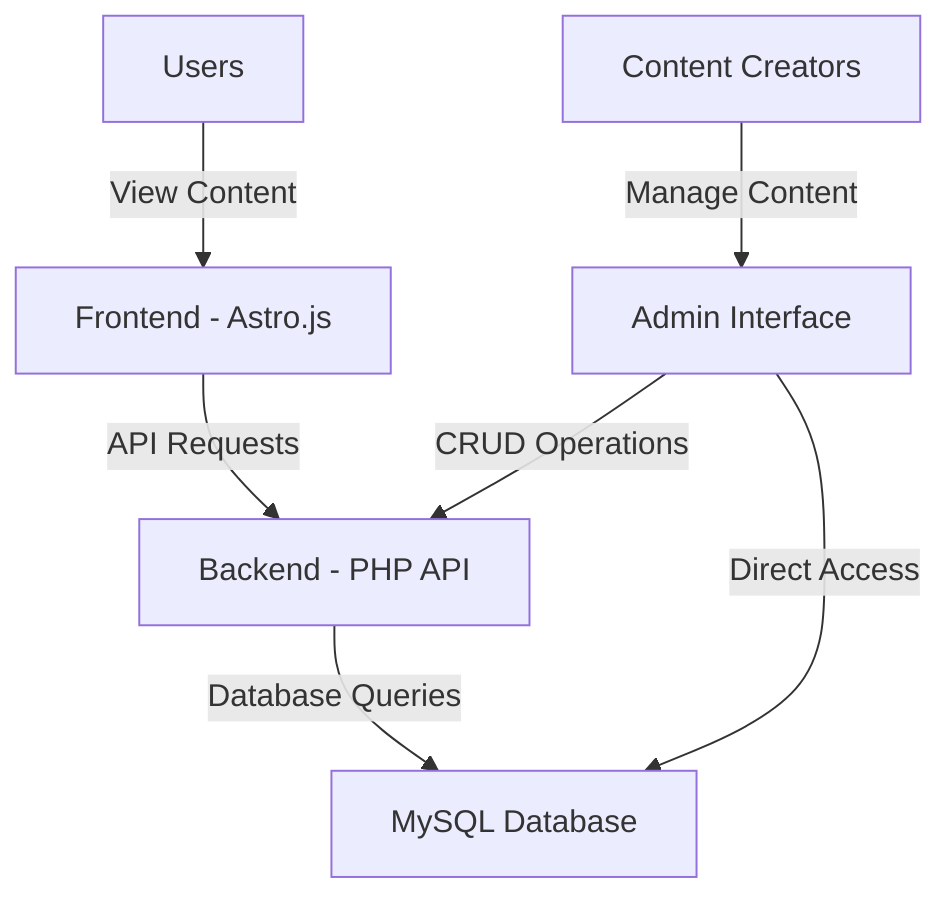
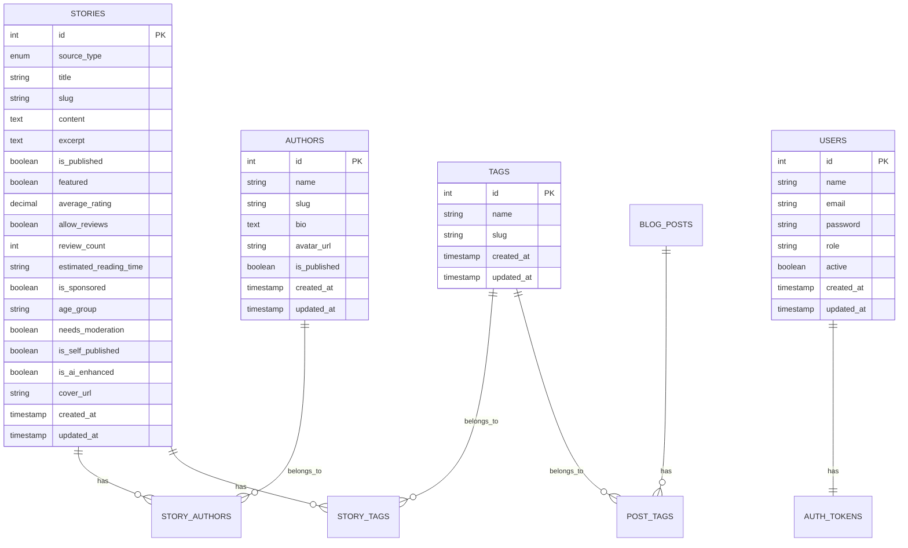
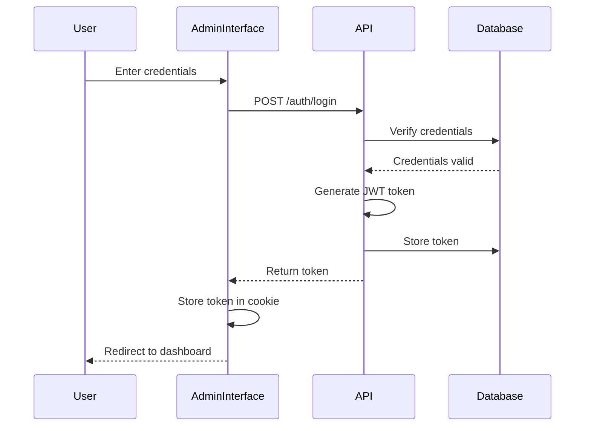
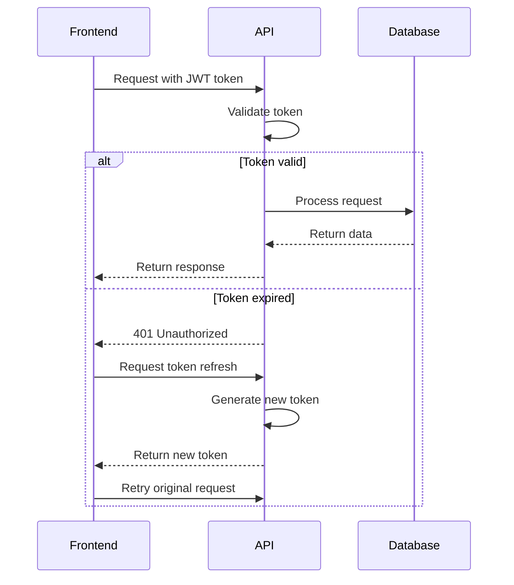
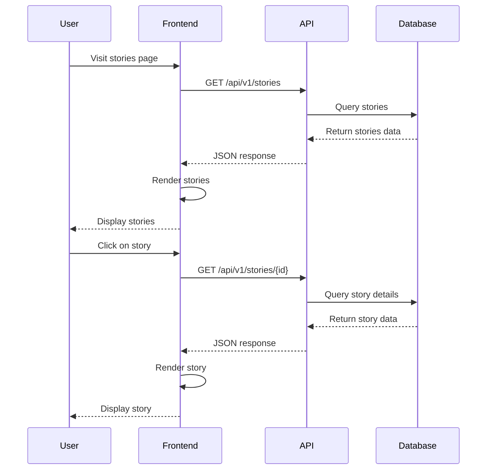
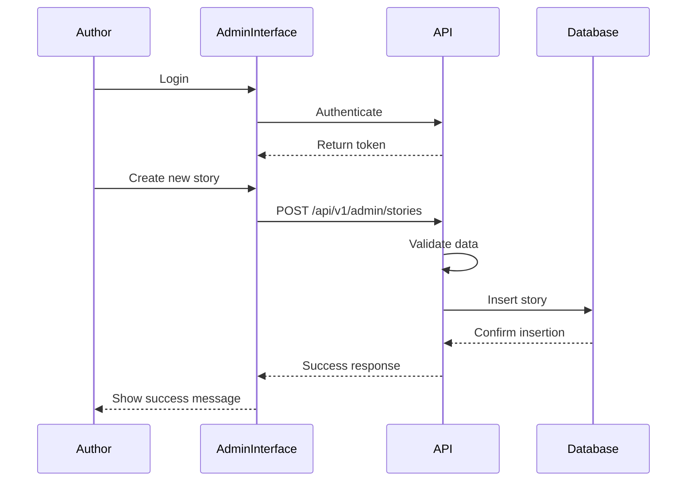
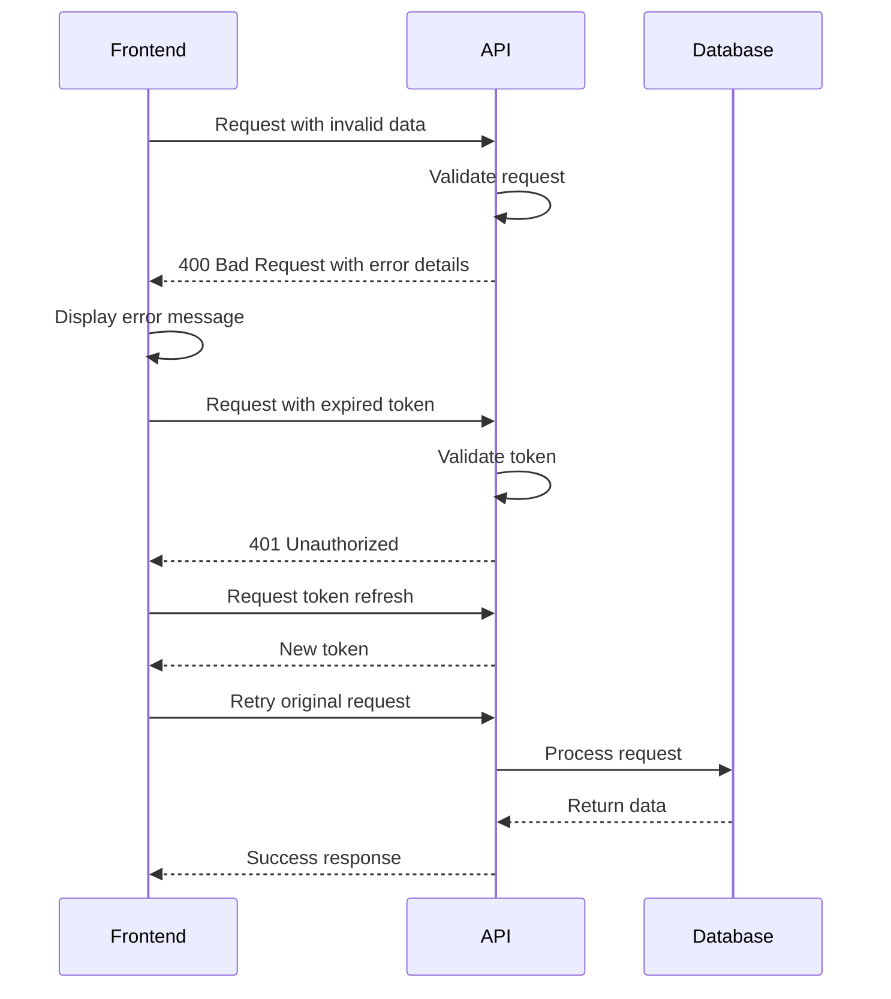
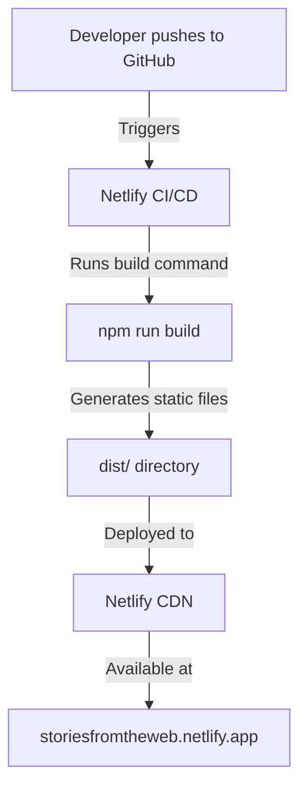
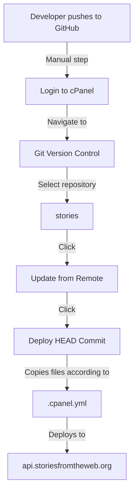

# Comprehensive System Architecture Documentation

This document provides a detailed and comprehensive overview of the Stories from the Web platform architecture, including system components, database schema, API endpoints, interaction flows, folder structures, and deployment processes. It is designed to serve as a complete reference for developers and AI assistants working on the project.

## Table of Contents

- [Project Overview](#project-overview)
- [Complete Tech Stack](#complete-tech-stack)
- [Environment Details](#environment-details)
- [Architecture Components](#architecture-components)
- [Frontend Architecture](#frontend-architecture)
- [Backend Architecture](#backend-architecture)
- [Database Schema](#database-schema)
- [API Endpoints](#api-endpoints)
- [Authentication System](#authentication-system)
- [Data Flow Processes](#data-flow-processes)
- [Deployment Processes](#deployment-processes)
- [Key Files and Components](#key-files-and-components)
- [Important Documentation References](#important-documentation-references)
- [Getting Started Guide](#getting-started-guide)

## Project Overview

Stories from the Web is a platform for sharing and discovering stories, with additional features for games, directory listings, and AI tools. The platform consists of two main components:

1. **Public Frontend**: A user-facing website where visitors can browse and read stories, explore games, view directory listings, and discover AI tools.
2. **Admin Backend**: A content management system where administrators and authors can create, edit, and manage content.

The platform is designed with a clear separation between the frontend and backend, communicating through a RESTful API. This architecture allows for independent development and deployment of each component.

## Complete Tech Stack

### Frontend
- **Framework**: Astro.js (v2.x)
- **Styling**: Tailwind CSS
- **Language**: TypeScript
- **Build Tool**: Vite (integrated with Astro)
- **Package Manager**: npm
- **Deployment**: Netlify

### Backend
- **Language**: PHP (v8.3.x)
- **Database**: MySQL (v8.0.x)
- **Server**: Apache (on cPanel shared hosting)
- **Authentication**: Custom JWT implementation
- **Deployment**: cPanel Git Version Control

### Development Tools
- **Version Control**: Git (GitHub)
- **IDE**: Visual Studio Code (recommended)
- **API Testing**: Postman or browser-based tools
- **Database Management**: phpMyAdmin (via cPanel)

## Environment Details

### Production Environments

#### Frontend
- **URL**: https://storiesfromtheweb.netlify.app/
- **Hosting**: Netlify
- **Repository**: https://github.com/OpaceDigitalAgency/stories
- **Branch**: main
- **Deployment**: Automatic on push to main branch

#### Backend
- **API URL**: https://api.storiesfromtheweb.org/
- **Admin URL**: https://api.storiesfromtheweb.org/admin/
- **Hosting**: cPanel shared hosting
- **Repository**: https://github.com/OpaceDigitalAgency/stories
- **Branch**: main
- **Deployment**: Manual via cPanel Git Version Control

### Development Environment Setup

1. **Clone Repository**:
   ```bash
   git clone https://github.com/OpaceDigitalAgency/stories.git
   cd stories
   ```

2. **Frontend Setup**:
   ```bash
   npm install
   npm run dev
   ```
   - Development server runs at: http://localhost:3000

3. **Backend Setup**:
   - Configure local web server (Apache/Nginx) to point to `stories-backend` directory
   - Import database from `stories-backend/database/stories_db_26.04.25_1337.sql`
   - Update database configuration in `stories-backend/api/v1/config/config.php`

4. **Environment Variables**:
   - Frontend: Create `.env` file with `PUBLIC_API_URL=http://localhost/stories-backend/api/v1`
   - Backend: Update database credentials in config.php

## Architecture Components

### High-Level Architecture



This architecture provides several benefits:
- **Separation of Concerns**: Frontend and backend can be developed independently
- **Scalability**: Each component can be scaled separately
- **Security**: Admin interface is isolated from public frontend
- **Performance**: Static frontend with dynamic data loading

### Component Interactions

The components interact through well-defined interfaces:
1. Frontend makes API requests to backend for data
2. Backend processes requests, performs database operations, and returns responses
3. Admin interface provides UI for content management
4. Database stores all content and user data

## Frontend Architecture

### Overview

The frontend is built with Astro.js, a modern static site generator with dynamic capabilities. It uses a component-based architecture with TypeScript for type safety and Tailwind CSS for styling.

### Folder Structure

```
src/
├── components/         # Reusable UI components
│   ├── AIRecommendationBox.astro
│   ├── ApiErrorMessage.astro
│   ├── CardAuthor.astro
│   ├── CardStory.astro
│   ├── Footer.astro
│   ├── NavHeader.astro
│   ├── RatingStars.astro
│   └── ... (other components)
├── lib/                # Utility functions and API client
│   ├── api.ts          # API client for backend communication
│   └── mockData.ts     # Mock data for development
├── pages/              # Page components and routes
│   ├── index.astro     # Homepage
│   ├── stories/        # Story pages
│   │   ├── index.astro # Stories listing
│   │   └── [slug].astro # Individual story page
│   ├── authors/        # Author pages
│   ├── games/          # Games pages
│   ├── directories/    # Directory pages
│   ├── ai-tools/       # AI tools pages
│   ├── blog/           # Blog pages
│   ├── login/          # Login page
│   ├── profile/        # User profile page
│   └── publish/        # Content creation pages
├── styles/             # Global styles
│   └── base.css        # Base styles with Tailwind imports
└── types/              # TypeScript type definitions
    └── components.ts   # Component type definitions
```

### Key Components

1. **API Client** (`src/lib/api.ts`):
   - Handles all communication with the backend API
   - Implements error handling
   - Provides typed interfaces for API responses
   - Maps API response fields to component props
   - Supports flat data structure from API
   - Includes resource-specific fetch functions for each content type:
     - `fetchStories`: Fetches stories with filtering options
     - `fetchAuthors`: Fetches authors
     - `fetchBlogPosts`: Fetches blog posts
     - `fetchGames`: Fetches games
     - `fetchDirectoryItems`: Fetches directory items
     - `fetchAiTools`: Fetches AI tools

2. **Page Components**:
   - Each page is an Astro component that fetches data and renders content
   - Dynamic routes use Astro's file-based routing system
   - Server-side rendering for SEO optimization

3. **UI Components**:
   - Reusable components for consistent UI across the site
   - Tailwind CSS for styling
   - Responsive design for mobile and desktop

### Data Flow

1. User visits a page
2. Astro component fetches data from API during build or client-side
3. Data is rendered using Astro components
4. Interactive elements use client-side JavaScript

## Backend Architecture

### Overview

The backend is built with PHP and follows a custom MVC-like architecture. It provides a RESTful API for the frontend and an admin interface for content management.

### Folder Structure

```
stories-backend/
├── admin/              # Admin interface
│   ├── assets/         # CSS, JS, and images
│   ├── includes/       # Admin PHP includes
│   │   ├── AdminPage.php
│   │   ├── ApiClient.php
│   │   ├── Auth.php
│   │   ├── config.php
│   │   ├── CrudPage.php
│   │   ├── Database.php
│   │   ├── FileUpload.php
│   │   ├── Pagination.php
│   │   └── Validator.php
│   ├── views/          # Admin UI templates
│   ├── index.php       # Admin dashboard
│   ├── login.php       # Admin login
│   ├── stories.php     # Stories management
│   ├── authors.php     # Authors management
│   └── ... (other admin pages)
├── api/                # API endpoints
│   ├── v1/             # API version 1
│   │   ├── api.php     # Main API router
│   │   ├── config/     # API configuration
│   │   │   └── config.php
│   │   ├── Core/       # Core API classes
│   │   ├── Endpoints/  # API endpoint controllers
│   │   └── Middleware/ # API middleware
│   └── index.php       # API entry point
├── database/           # Database scripts
│   └── stories_db_26.04.25_1337.sql # Latest database dump
├── .htaccess           # Apache configuration
└── ... (utility scripts)
```

### Key Components

1. **API Router** (`api/v1/api.php`):
   - Routes API requests to appropriate handlers
   - Implements basic authentication
   - Handles error responses
   - Manages database connections

2. **Admin Interface**:
   - PHP-based admin panel with minimal JavaScript
   - Direct form submissions for reliability
   - Session-based authentication
   - CRUD operations for all content types

3. **Authentication System**:
   - JWT-based authentication for API
   - Session-based authentication for admin interface
   - Token refresh mechanism for expired tokens

### API Architecture

The API follows a simplified RESTful architecture:
- Endpoints correspond to resource types (stories, authors, etc.)
- HTTP methods define operations (GET, POST, PUT, DELETE)
- Responses use a standardized flat array format
- Authentication via JWT tokens in Authorization header

## Database Schema

### Entity Relationship Diagram



### Key Tables and Relationships

1. **Content Tables**:
   - `stories`: Main content table for stories
   - `authors`: Information about story authors
   - `tags`: Categories and tags for content
   - `blog_posts`: Blog content
   - `games`: Interactive story games
   - `directory_items`: Directory listings (can link to stories via story_id)
   - `ai_tools`: AI tool listings

2. **Relationship Tables**:
   - `story_authors`: Many-to-many relationship between stories and authors
   - `story_tags`: Many-to-many relationship between stories and tags
   - `post_tags`: Many-to-many relationship between blog posts and tags

3. **User Tables**:
   - `users`: User accounts for authentication
   - `auth_tokens`: JWT tokens for authentication

4. **Category Tables**:
   - `ai_tool_categories`: Categories for AI tools
   - `directory_categories`: Categories for directory items

### Database Design Principles

1. **Normalization**: Tables are normalized to reduce redundancy
2. **Relationships**: Foreign keys maintain referential integrity
3. **Indexing**: Primary keys and frequently queried fields are indexed
4. **Timestamps**: All tables include created_at and updated_at timestamps
5. **Soft Deletes**: Content is marked as unpublished rather than deleted

### Story Source Types and Review Rules

The stories table includes special columns to handle different contributor types:

1. **source_type**: An ENUM field with three possible values:
   - `child`: Stories created by children
   - `parent`: Stories created by parents or families
   - `classic`: Classic works seeded by administrators

2. **allow_reviews**: A boolean field controlling whether reviews are allowed

These fields implement the following business rules:

- **Children's stories** (`source_type = 'child'`):
  - Never receive public reviews (`allow_reviews = 0`)
  - Use a child-specific default cover image
  - Have simplified UI with basic form fields

- **Parent/family stories** (`source_type = 'parent'`):
  - May choose whether their story is reviewable
  - Use a parent-specific default cover image
  - Have access to all form fields

- **Classic works** (`source_type = 'classic'`):
  - Always open to ratings (`allow_reviews = 1`)
  - Use a classic-specific default cover image
  - Are seeded by administrators

3. **Directory Integration**:
  - Directory items can link back to hosted stories via the `story_id` column
  - This allows the same review data to appear beside external resources

## API Endpoints

### Content Endpoints

| Endpoint | Method | Description | Response Format |
|----------|--------|-------------|-----------------|
| `/api/v1/stories` | GET | List all stories | Flat Array |
| `/api/v1/stories/{id}` | GET | Get specific story | Single Object |
| `/api/v1/authors` | GET | List all authors | Flat Array |
| `/api/v1/authors/{id}` | GET | Get specific author | Single Object |
| `/api/v1/tags` | GET | List all tags | Flat Array |
| `/api/v1/games` | GET | List all games | Flat Array |
| `/api/v1/directory-items` | GET | List all directory items | Flat Array |
| `/api/v1/ai-tools` | GET | List all AI tools | Flat Array |
| `/api/v1/blog-posts` | GET | List all blog posts | Flat Array |

### Authentication Endpoints

| Endpoint | Method | Description |
|----------|--------|-------------|
| `/api/v1/auth/login` | POST | Authenticate user and get token |
| `/api/v1/auth/logout` | POST | Invalidate current token |
| `/api/v1/auth/me` | GET | Get current user information |
| `/api/v1/auth/refresh` | POST | Refresh authentication token |

### Admin Endpoints

| Endpoint | Method | Description |
|----------|--------|-------------|
| `/api/v1/admin/stories` | POST | Create new story |
| `/api/v1/admin/stories/{id}` | PUT | Update existing story |
| `/api/v1/admin/stories/{id}` | DELETE | Delete story |
| `/api/v1/admin/media` | POST | Upload media file |
| `/api/v1/admin/media/{id}` | DELETE | Delete media file |

### Response Format

All API endpoints return responses in a consistent flat array format:

```json
[
  {
    "id": 1,
    "title": "Example Story",
    "slug": "example-story",
    "excerpt": "This is a sample story excerpt",
    "cover_url": "https://example.com/images/story1.jpg",
    "publishedAt": "2025-04-15T10:30:00Z"
  },
  {
    "id": 2,
    "title": "Another Story",
    "slug": "another-story",
    "excerpt": "Another sample story excerpt",
    "cover_url": "https://example.com/images/story2.jpg",
    "publishedAt": "2025-04-14T14:45:00Z"
  }
]
```

The frontend maps these fields to component props:
- `title` → `title`
- `excerpt` → `excerpt`
- `cover_url` → `coverImage`
- `slug` → `slug`
- `publishedAt` → `publishDate`
- `source_type` → `source_type`
- `allow_reviews` → `allow_reviews`

For authors:
- `name` → `name`
- `bio` → `bio`
- `avatar_url` → `avatar`
- `slug` → `slug`

For games:
- `title` → `title`
- `description` → `description`
- `cover_url` → `coverImage`
- `slug` → `slug`
- `price` → `price`
- `rating` → `rating`

For directory items:
- `title` → `title`
- `description` → `description`
- `cover_url` → `coverImage`
- `slug` → `slug`
- `category` → `category`
- `rating` → `rating`
- `price_range` → `priceRange`

For AI tools:
- `title` → `title`
- `description` → `description`
- `cover_url` → `coverImage`
- `slug` → `slug`
- `category` → `category`
- `pricing_type` → `pricingType`
- `featured` → `featured`

Error responses use a standard format:

```json
{
  "error": {
    "status": 404,
    "message": "Resource not found"
  }
}
```

## Authentication System

### JWT Authentication

The system uses JSON Web Tokens (JWT) for API authentication:

1. **Token Structure**:
   - Header: Algorithm and token type
   - Payload: User ID, role, and expiration time
   - Signature: HMAC SHA256 signature

2. **Token Storage**:
   - Frontend: Stored in cookies with HttpOnly flag
   - Backend: Stored in database and PHP session

3. **Token Lifecycle**:
   - Generated on successful login
   - Included in Authorization header for API requests
   - Expires after configurable time period (default: 24 hours)
   - Can be refreshed using refresh endpoint

### Authentication Flow



### Token Refresh Mechanism



### Security Considerations

1. **Token Security**:
   - Tokens are signed with a secret key
   - Tokens have a limited lifetime
   - Tokens can be revoked by deleting from database

2. **Password Security**:
   - Passwords are hashed using bcrypt
   - Failed login attempts are rate-limited
   - Password reset requires email verification

3. **HTTPS**:
   - All API communication is over HTTPS
   - Cookies are set with Secure and HttpOnly flags
   - Content Security Policy prevents XSS attacks

## Data Flow Processes

### Content Viewing Flow



### Content Creation Flow



### Error Handling Flow



## Deployment Processes

### Frontend Deployment (Netlify)



1. **Process Details**:
   - Developer pushes changes to GitHub repository
   - Netlify automatically detects changes
   - Netlify runs the build command: `npm run build`
   - Astro generates static HTML, CSS, and JavaScript
   - Files are deployed to Netlify's CDN
   - Site is available at https://storiesfromtheweb.netlify.app/

2. **Configuration**:
   - `netlify.toml` in repository root configures the build
   - Environment variables set in Netlify dashboard
   - Redirects configured for SPA routing

3. **Monitoring**:
   - Netlify provides build logs
   - Deploy previews for pull requests
   - Rollback capability for failed deployments

### Backend Deployment (cPanel Git Version Control)



1. **Process Details**:
   - Developer pushes changes to GitHub repository
   - Administrator logs in to cPanel
   - Navigates to Git Version Control
   - Selects the "stories" repository
   - Clicks "Update from Remote" to pull latest changes
   - Clicks "Deploy HEAD Commit" to deploy
   - Files are copied according to `.cpanel.yml` configuration
   - Changes are live at https://api.storiesfromtheweb.org/

2. **Configuration**:
   - `.cpanel.yml` in repository root defines deployment tasks
   - Example configuration:
     ```yaml
     ---
     deployment:
       tasks:
         - export DEPLOYPATH=/home/stories/api.storiesfromtheweb.org/
         - /bin/cp -R stories-backend/check_auth_status.php $DEPLOYPATH
         - /bin/cp -R stories-backend/direct_login.php $DEPLOYPATH
         - /bin/cp -R stories-backend/go_to_dashboard.php $DEPLOYPATH
         - /bin/cp -R stories-backend/logout.php $DEPLOYPATH
         - /bin/cp -R stories-backend/.htaccess $DEPLOYPATH
         - /bin/cp -R stories-backend/admin $DEPLOYPATH
         - /bin/cp -R stories-backend/api $DEPLOYPATH
     ```

3. **Access Details**:
   - cPanel URL: https://cpanel.storiesfromtheweb.org/
   - Username: Contact administrator for credentials
   - Git repository: https://github.com/OpaceDigitalAgency/stories

## Key Files and Components

### Critical Frontend Files

1. **API Client** (`src/lib/api.ts`):
   - Handles all API communication
   - Manages authentication tokens
   - Implements error handling

2. **Component Types** (`src/types/components.ts`):
   - Defines TypeScript interfaces for all components
   - Ensures type safety across the application

3. **Page Components**:
   - `src/pages/index.astro`: Homepage
   - `src/pages/stories/index.astro`: Stories listing
   - `src/pages/stories/[slug].astro`: Individual story page

4. **Reusable Components**:
   - `src/components/NavHeader.astro`: Navigation header
   - `src/components/Footer.astro`: Footer
   - `src/components/CardStory.astro`: Story card component

### Critical Backend Files

1. **API Router** (`api/v1/api.php`):
   - Main entry point for API requests
   - Routes requests to appropriate handlers
   - Manages database connections

2. **Authentication** (`admin/includes/Auth.php`):
   - Handles user authentication
   - Manages JWT tokens
   - Implements security measures

3. **Database** (`admin/includes/Database.php`):
   - Provides database connection
   - Implements query methods
   - Handles error reporting

4. **Admin Pages**:
   - `admin/index.php`: Admin dashboard
   - `admin/login.php`: Login page
   - `admin/stories.php`: Stories management

## Important Documentation References

### Project Documentation

1. [**README.md**](../README.md) - Project overview and basic information
2. [**PLANNING.md**](../PLANNING.md) - Project architecture, goals, and constraints
3. [**PROGRESS.md**](../PROGRESS.md) - Log of completed work
4. [**API_CONNECTIVITY_FIX.md**](../API_CONNECTIVITY_FIX.md) - Guide for fixing API connectivity issues

### Cleanup and Standardization Documentation

5. [**Project Cleanup Summary**](../project-cleanup-summary.md) - Overview of the cleanup initiative
6. [**Stories Cleanup Plan**](../stories-cleanup-plan.md) - Comprehensive plan for cleaning up the codebase
7. [**Database Schema**](../database-schema.md) - Complete documentation of the database schema
8. [**API Documentation**](../api-documentation.md) - Comprehensive documentation of all API endpoints
9. [**PHP Scripts Cleanup Guide**](../php-scripts-cleanup-guide.md) - Guide for cleaning up PHP scripts
10. [**Implementation Plan**](../implementation-plan.md) - Detailed implementation plan

### Deployment Documentation

11. [**Consolidated Deployment Guide**](consolidated-deployment-guide.md) - Comprehensive guide for deploying the platform

### Documentation Index

12. [**Documentation Index**](documentation-index.md) - Central index for all documentation

## Getting Started Guide

### For New Developers

1. **Setup Development Environment**:
   - Clone repository: `git clone https://github.com/OpaceDigitalAgency/stories.git`
   - Install dependencies: `npm install`
   - Start development server: `npm run dev`

2. **Backend Setup**:
   - Configure local web server to point to `stories-backend` directory
   - Import database from `stories-backend/database/stories_db_26.04.25_1337.sql`
   - Update database configuration in `stories-backend/api/v1/config/config.php`

3. **Access Points**:
   - Frontend: http://localhost:3000
   - Backend API: http://localhost/stories-backend/api/v1
   - Admin Interface: http://localhost/stories-backend/admin

4. **Authentication**:
   - Admin login: admin@storiesfromtheweb.org / password123 (development only)
   - API authentication: Use JWT token from login response

### For AI Assistants

When working on this project, consider the following:

1. **Project Structure**:
   - Frontend code is in `src/` directory
   - Backend code is in `stories-backend/` directory
   - Database schema is in `stories-backend/database/`

2. **API Conventions**:
   - All endpoints return flat array responses
   - Authentication uses JWT tokens in Authorization header
   - Error responses include status and message

3. **Development Workflow**:
   - Frontend changes are automatically deployed to Netlify
   - Backend changes require manual deployment via cPanel
   - Database changes should be documented in SQL files

4. **Documentation**:
   - Refer to this document for comprehensive architecture overview
   - Check specific documentation files for detailed information
   - Update documentation when making significant changes