# Stories from the Web - Database Schema Documentation

This document provides a comprehensive overview of the database schema for the Stories from the Web platform, including table structures, relationships, and data types.

## Table of Contents

- [Overview](#overview)
- [Entity Relationship Diagram](#entity-relationship-diagram)
- [Core Tables](#core-tables)
  - [stories](#stories)
  - [authors](#authors)
  - [tags](#tags)
  - [users](#users)
  - [blog_posts](#blog_posts)
  - [games](#games)
  - [directory_items](#directory_items)
  - [ai_tools](#ai_tools)
- [Relationship Tables](#relationship-tables)
  - [story_authors](#story_authors)
  - [story_tags](#story_tags)
  - [post_tags](#post_tags)
- [Authentication Tables](#authentication-tables)
  - [auth_tokens](#auth_tokens)
- [Category Tables](#category-tables)
  - [ai_tool_categories](#ai_tool_categories)
  - [directory_categories](#directory_categories)
- [Media Tables](#media-tables)
  - [media](#media)

## Overview

The Stories from the Web database uses a relational MySQL schema with the following characteristics:

- **Character Set**: utf8mb4
- **Collation**: utf8mb4_unicode_ci (for most tables)
- **Engine**: InnoDB (for most tables)
- **Relationships**: Enforced with foreign key constraints
- **Timestamps**: Automatic creation and update timestamps

## Entity Relationship Diagram

```mermaid
erDiagram
    STORIES ||--o{ STORY_AUTHORS : has
    STORIES ||--o{ STORY_TAGS : has
    AUTHORS ||--o{ STORY_AUTHORS : belongs_to
    TAGS ||--o{ STORY_TAGS : belongs_to
    BLOG_POSTS ||--o{ POST_TAGS : has
    TAGS ||--o{ POST_TAGS : belongs_to
    USERS ||--|| AUTH_TOKENS : has
    AI_TOOLS }o--|| AI_TOOL_CATEGORIES : belongs_to
    DIRECTORY_ITEMS }o--|| DIRECTORY_CATEGORIES : belongs_to
    
    STORIES {
        int id PK
        enum source_type
        string title
        string slug
        text content
        text excerpt
        boolean is_published
        boolean featured
        decimal average_rating
        boolean allow_reviews
        int review_count
        string estimated_reading_time
        boolean is_sponsored
        string age_group
        boolean needs_moderation
        boolean is_self_published
        boolean is_ai_enhanced
        string cover_url
        timestamp created_at
        timestamp updated_at
    }
    
    AUTHORS {
        int id PK
        string name
        string slug
        text bio
        string avatar_url
        boolean is_published
        timestamp created_at
        timestamp updated_at
        enum author_type
        int age
        string location
    }
    
    TAGS {
        int id PK
        string name
        string slug
        timestamp created_at
        timestamp updated_at
    }
    
    USERS {
        int id PK
        string name
        string email
        string password
        string role
        boolean active
        timestamp created_at
        timestamp updated_at
    }
    
    BLOG_POSTS {
        int id PK
        string title
        string slug
        text content
        text excerpt
        boolean is_published
        int author_id FK
        string cover_url
        timestamp created_at
        timestamp updated_at
    }
    
    GAMES {
        int id PK
        string title
        string description
        string slug
        string website_url
        string genre
        string platform
        string developer
        string publisher
        date release_date
        decimal rating
        decimal price
        string cover_url
        boolean is_published
        timestamp created_at
        timestamp updated_at
    }
    
    DIRECTORY_ITEMS {
        int id PK
        string title
        string description
        int category_id FK
        string slug
        datetime published_at
        string website_url
        string contact_email
        string contact_phone
        text address
        boolean featured
        decimal rating
        string price_range
        string cover_url
        boolean is_published
        timestamp created_at
        timestamp updated_at
        int story_id FK
    }
    
    AI_TOOLS {
        int id PK
        string title
        string description
        int category_id FK
        string slug
        datetime published_at
        string tool_url
        enum pricing_type
        string price_info
        text features
        decimal rating
        boolean featured
        string cover_url
        boolean is_published
        timestamp created_at
        timestamp updated_at
    }
    
    STORY_AUTHORS {
        int story_id PK,FK
        int author_id PK,FK
    }
    
    STORY_TAGS {
        int story_id PK,FK
        int tag_id PK,FK
    }
    
    POST_TAGS {
        int post_id PK,FK
        int tag_id PK,FK
    }
    
    AUTH_TOKENS {
        int user_id PK,FK
        string token
        datetime expires_at
        timestamp created_at
    }
    
    AI_TOOL_CATEGORIES {
        int id PK
        string name
        string slug
        text description
        timestamp created_at
        timestamp updated_at
    }
    
    DIRECTORY_CATEGORIES {
        int id PK
        string name
        string slug
        text description
        timestamp created_at
        timestamp updated_at
    }
    
    MEDIA {
        int id PK
        string filename
        string file_path
        string thumbnail_url
        string small_url
        string medium_url
        string large_url
        string file_type
        int file_size
        string alt_text
        timestamp created_at
        timestamp updated_at
    }
```

## Core Tables

### stories

The main table for story content.

| Column | Type | Constraints | Description |
|--------|------|-------------|-------------|
| id | int | PRIMARY KEY, AUTO_INCREMENT | Unique identifier |
| source_type | enum('child','parent','classic') | NOT NULL, DEFAULT 'child' | Source type of the story |
| title | varchar(255) | NOT NULL | Story title |
| content | text | NULL | Full story content |
| excerpt | text | NULL | Short summary of the story |
| slug | varchar(255) | NOT NULL, UNIQUE | URL-friendly identifier |
| is_published | tinyint(1) | DEFAULT 1 | Publication status |
| featured | tinyint(1) | DEFAULT 0 | Whether story is featured |
| average_rating | decimal(3,1) | DEFAULT 4.5 | Average user rating |
| allow_reviews | tinyint(1) | NOT NULL, DEFAULT 0 | Whether reviews are allowed |
| review_count | int | DEFAULT 10 | Number of reviews |
| estimated_reading_time | varchar(50) | DEFAULT '5 minutes' | Estimated time to read |
| is_sponsored | tinyint(1) | DEFAULT 0 | Whether content is sponsored |
| age_group | varchar(50) | DEFAULT '12+' | Target age group |
| needs_moderation | tinyint(1) | DEFAULT 0 | Moderation flag |
| is_self_published | tinyint(1) | DEFAULT 1 | Self-publication flag |
| is_ai_enhanced | tinyint(1) | DEFAULT 0 | AI enhancement flag |
| cover_url | varchar(255) | DEFAULT 'https://example.com/cover.jpg' | Cover image URL |
| created_at | timestamp | DEFAULT CURRENT_TIMESTAMP | Creation timestamp |
| updated_at | timestamp | DEFAULT CURRENT_TIMESTAMP ON UPDATE CURRENT_TIMESTAMP | Update timestamp |

### authors

Information about content creators.

| Column | Type | Constraints | Description |
|--------|------|-------------|-------------|
| id | int | PRIMARY KEY, AUTO_INCREMENT | Unique identifier |
| name | varchar(255) | NOT NULL | Author's name |
| slug | varchar(255) | NOT NULL, UNIQUE | URL-friendly identifier |
| bio | text | NULL | Author biography |
| avatar_url | varchar(255) | NULL | Profile image URL |
| is_published | tinyint(1) | DEFAULT 1 | Publication status |
| created_at | timestamp | DEFAULT CURRENT_TIMESTAMP | Creation timestamp |
| updated_at | timestamp | DEFAULT CURRENT_TIMESTAMP ON UPDATE CURRENT_TIMESTAMP | Update timestamp |
| author_type | enum('retail','parent','child','educator') | NOT NULL, DEFAULT 'parent' | Type of author |
| age | tinyint unsigned | NULL | Age (only for child authors) |
| location | varchar(100) | NULL | Author's location (city, county, or country) |

### tags

Categories and tags for content classification.

| Column | Type | Constraints | Description |
|--------|------|-------------|-------------|
| id | int | PRIMARY KEY, AUTO_INCREMENT | Unique identifier |
| name | varchar(255) | NOT NULL | Tag name |
| slug | varchar(255) | NOT NULL, UNIQUE | URL-friendly identifier |
| created_at | timestamp | DEFAULT CURRENT_TIMESTAMP | Creation timestamp |
| updated_at | timestamp | DEFAULT CURRENT_TIMESTAMP ON UPDATE CURRENT_TIMESTAMP | Update timestamp |

### users

User accounts for authentication and authorization.

| Column | Type | Constraints | Description |
|--------|------|-------------|-------------|
| id | int | PRIMARY KEY, AUTO_INCREMENT | Unique identifier |
| name | varchar(255) | NOT NULL | User's name |
| email | varchar(255) | NOT NULL, UNIQUE | Email address |
| password | varchar(255) | NOT NULL | Hashed password |
| role | varchar(50) | NOT NULL, DEFAULT 'user' | User role (admin, user, etc.) |
| active | tinyint(1) | NOT NULL, DEFAULT 1 | Account status |
| created_at | timestamp | DEFAULT CURRENT_TIMESTAMP | Creation timestamp |
| updated_at | timestamp | DEFAULT CURRENT_TIMESTAMP ON UPDATE CURRENT_TIMESTAMP | Update timestamp |

### blog_posts

Blog content for the platform.

| Column | Type | Constraints | Description |
|--------|------|-------------|-------------|
| id | int | PRIMARY KEY, AUTO_INCREMENT | Unique identifier |
| title | varchar(255) | NOT NULL | Blog post title |
| content | text | NULL | Full blog post content |
| excerpt | text | NULL | Short summary |
| slug | varchar(255) | NOT NULL, UNIQUE | URL-friendly identifier |
| is_published | tinyint(1) | DEFAULT 1 | Publication status |
| author_id | int | NULL, FOREIGN KEY | Reference to authors.id |
| cover_url | varchar(255) | NULL | Cover image URL |
| created_at | timestamp | DEFAULT CURRENT_TIMESTAMP | Creation timestamp |
| updated_at | timestamp | DEFAULT CURRENT_TIMESTAMP ON UPDATE CURRENT_TIMESTAMP | Update timestamp |

### games

Interactive story games.

| Column | Type | Constraints | Description |
|--------|------|-------------|-------------|
| id | int | PRIMARY KEY, AUTO_INCREMENT | Unique identifier |
| title | varchar(255) | NOT NULL | Game title |
| description | text | NULL | Game description |
| slug | varchar(255) | NOT NULL, UNIQUE | URL-friendly identifier |
| website_url | varchar(255) | NULL | Game website URL |
| genre | varchar(100) | NULL | Game genre |
| platform | varchar(100) | NULL | Platform (PC, mobile, etc.) |
| developer | varchar(255) | NULL | Game developer |
| publisher | varchar(255) | NULL | Game publisher |
| release_date | date | NULL | Release date |
| rating | decimal(3,1) | DEFAULT 0.0 | Average user rating |
| price | decimal(10,2) | DEFAULT 0.00 | Game price |
| cover_url | varchar(255) | NULL | Cover image URL |
| is_published | tinyint(1) | DEFAULT 1 | Publication status |
| created_at | timestamp | DEFAULT CURRENT_TIMESTAMP | Creation timestamp |
| updated_at | timestamp | DEFAULT CURRENT_TIMESTAMP ON UPDATE CURRENT_TIMESTAMP | Update timestamp |

### directory_items

Directory listings for related resources.

| Column | Type | Constraints | Description |
|--------|------|-------------|-------------|
| id | int | PRIMARY KEY, AUTO_INCREMENT | Unique identifier |
| title | varchar(255) | NOT NULL | Directory item title |
| description | text | NULL | Item description |
| category_id | int | NULL, FOREIGN KEY | Reference to directory_categories.id |
| slug | varchar(255) | NOT NULL, UNIQUE | URL-friendly identifier |
| published_at | datetime | NULL | Publication date/time |
| website_url | varchar(255) | NOT NULL | Website URL |
| contact_email | varchar(255) | NULL | Contact email |
| contact_phone | varchar(50) | NULL | Contact phone number |
| address | text | NULL | Physical address |
| featured | tinyint(1) | NOT NULL, DEFAULT 0 | Featured status |
| rating | decimal(3,1) | DEFAULT 0.0 | Average user rating |
| price_range | varchar(50) | NULL | Price range indicator |
| cover_url | varchar(255) | NULL | Cover image URL |
| is_published | tinyint(1) | NOT NULL, DEFAULT 0 | Publication status |
| created_at | datetime | NOT NULL, DEFAULT CURRENT_TIMESTAMP | Creation timestamp |
| updated_at | datetime | NOT NULL, DEFAULT CURRENT_TIMESTAMP ON UPDATE CURRENT_TIMESTAMP | Update timestamp |
| story_id | int | NULL, FOREIGN KEY | Reference to stories.id |

### ai_tools

AI tool listings.

| Column | Type | Constraints | Description |
|--------|------|-------------|-------------|
| id | int | PRIMARY KEY, AUTO_INCREMENT | Unique identifier |
| title | varchar(255) | NOT NULL | Tool title |
| description | text | NULL | Tool description |
| category_id | int | NULL, FOREIGN KEY | Reference to ai_tool_categories.id |
| slug | varchar(255) | NOT NULL, UNIQUE | URL-friendly identifier |
| published_at | datetime | NULL | Publication date/time |
| tool_url | varchar(255) | NULL | Tool website URL |
| pricing_type | enum('free','freemium','paid','subscription') | DEFAULT 'free' | Pricing model |
| price_info | varchar(255) | NULL | Pricing details |
| features | text | NULL | Tool features |
| rating | decimal(3,1) | DEFAULT 0.0 | Average user rating |
| featured | tinyint(1) | DEFAULT 0 | Featured status |
| cover_url | varchar(255) | NULL | Cover image URL |
| is_published | tinyint(1) | DEFAULT 0 | Publication status |
| created_at | datetime | NOT NULL, DEFAULT CURRENT_TIMESTAMP | Creation timestamp |
| updated_at | datetime | NOT NULL, DEFAULT CURRENT_TIMESTAMP ON UPDATE CURRENT_TIMESTAMP | Update timestamp |

## Relationship Tables

### story_authors

Many-to-many relationship between stories and authors.

| Column | Type | Constraints | Description |
|--------|------|-------------|-------------|
| story_id | int | PRIMARY KEY, FOREIGN KEY | Reference to stories.id |
| author_id | int | PRIMARY KEY, FOREIGN KEY | Reference to authors.id |

### story_tags

Many-to-many relationship between stories and tags.

| Column | Type | Constraints | Description |
|--------|------|-------------|-------------|
| story_id | int | PRIMARY KEY, FOREIGN KEY | Reference to stories.id |
| tag_id | int | PRIMARY KEY, FOREIGN KEY | Reference to tags.id |

### post_tags

Many-to-many relationship between blog posts and tags.

| Column | Type | Constraints | Description |
|--------|------|-------------|-------------|
| post_id | int | PRIMARY KEY, FOREIGN KEY | Reference to blog_posts.id |
| tag_id | int | PRIMARY KEY, FOREIGN KEY | Reference to tags.id |

## Authentication Tables

### auth_tokens

Stores authentication tokens for users.

| Column | Type | Constraints | Description |
|--------|------|-------------|-------------|
| user_id | int | PRIMARY KEY, FOREIGN KEY | Reference to users.id |
| token | varchar(255) | NOT NULL, UNIQUE | JWT token |
| expires_at | datetime | NOT NULL | Token expiration date/time |
| created_at | timestamp | DEFAULT CURRENT_TIMESTAMP | Creation timestamp |

## Category Tables

### ai_tool_categories

Categories for AI tools.

| Column | Type | Constraints | Description |
|--------|------|-------------|-------------|
| id | int | PRIMARY KEY, AUTO_INCREMENT | Unique identifier |
| name | varchar(255) | NOT NULL | Category name |
| slug | varchar(255) | NOT NULL | URL-friendly identifier |
| description | text | NULL | Category description |
| created_at | datetime | NOT NULL | Creation timestamp |
| updated_at | datetime | NOT NULL | Update timestamp |

### directory_categories

Categories for directory items.

| Column | Type | Constraints | Description |
|--------|------|-------------|-------------|
| id | int | PRIMARY KEY, AUTO_INCREMENT | Unique identifier |
| name | varchar(255) | NOT NULL | Category name |
| slug | varchar(255) | NOT NULL | URL-friendly identifier |
| description | text | NULL | Category description |
| created_at | datetime | NOT NULL | Creation timestamp |
| updated_at | datetime | NOT NULL | Update timestamp |

## Media Tables

### media

Stores information about uploaded media files with multiple size variants.

| Column | Type | Constraints | Description |
|--------|------|-------------|-------------|
| id | int | PRIMARY KEY, AUTO_INCREMENT | Unique identifier |
| filename | varchar(255) | NOT NULL | Original filename |
| file_path | varchar(255) | NOT NULL | Server file path (primary/medium size) |
| thumbnail_url | varchar(255) | NULL | URL for thumbnail size (150x150) |
| small_url | varchar(255) | NULL | URL for small size (300x300) |
| medium_url | varchar(255) | NULL | URL for medium size (640x640) |
| large_url | varchar(255) | NULL | URL for large size (1200x800) |
| file_type | varchar(100) | NOT NULL | MIME type |
| file_size | int | NOT NULL | File size in bytes |
| alt_text | varchar(255) | NULL | Alternative text for accessibility |
| created_at | datetime | NOT NULL | Creation timestamp |
| updated_at | datetime | NOT NULL | Update timestamp |

## Database Constraints

### Foreign Key Constraints

The database uses the following foreign key constraints to maintain referential integrity:

1. `story_authors_ibfk_1`: `story_authors.story_id` references `stories.id` (CASCADE on DELETE)
2. `story_authors_ibfk_2`: `story_authors.author_id` references `authors.id` (CASCADE on DELETE)
3. `story_tags_ibfk_1`: `story_tags.story_id` references `stories.id` (CASCADE on DELETE)
4. `story_tags_ibfk_2`: `story_tags.tag_id` references `tags.id` (CASCADE on DELETE)
5. `post_tags_ibfk_1`: `post_tags.post_id` references `blog_posts.id` (CASCADE on DELETE)
6. `post_tags_ibfk_2`: `post_tags.tag_id` references `tags.id` (CASCADE on DELETE)
7. `blog_posts_ibfk_1`: `blog_posts.author_id` references `authors.id` (SET NULL on DELETE)

### Unique Constraints

The following unique constraints are enforced:

1. `slug` on `stories`, `authors`, `tags`, `blog_posts`, `games`, `directory_items`, `ai_tools`
2. `email` on `users`
3. `token` on `auth_tokens`

## Indexing Strategy

The database uses the following indexing strategy to optimize query performance:

1. Primary keys on all tables
2. Foreign key indexes on all relationship tables
3. Unique indexes on slug fields for fast lookups
4. Index on `users.email` for fast authentication

## Data Types and Conventions

1. **IDs**: Integer primary keys with AUTO_INCREMENT
2. **Text Content**: VARCHAR for short text, TEXT for longer content
3. **URLs**: VARCHAR(255) for all URLs
4. **Booleans**: TINYINT(1) with DEFAULT values
5. **Timestamps**: TIMESTAMP with automatic update capabilities
6. **Dates**: DATE for specific dates, DATETIME for date/time combinations
7. **Enums**: Used sparingly (e.g., pricing_type) for constrained values