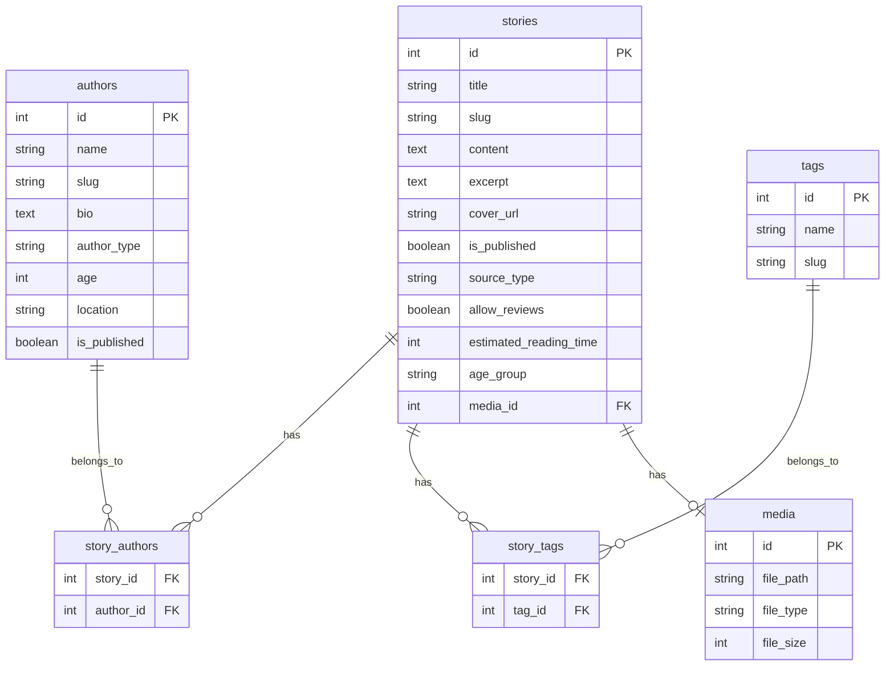
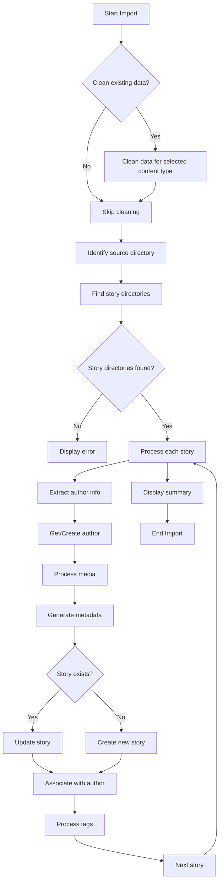
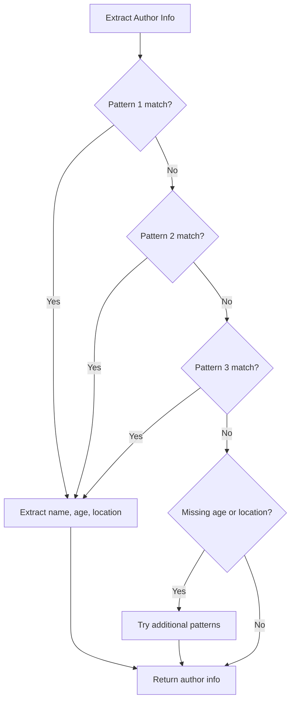

# Stories From The Web - Import System Code Documentation

This document provides a detailed explanation of the code behind the import system used in the Stories From The Web platform, including code snippets, function explanations, and diagrams.

## Table of Contents

1. [Import System Code Structure](#import-system-code-structure)
2. [Key Functions](#key-functions)
   - [Data Cleaning Functions](#data-cleaning-functions)
   - [Author Management Functions](#author-management-functions)
   - [Content Processing Functions](#content-processing-functions)
   - [Tag Management Functions](#tag-management-functions)
   - [Utility Functions](#utility-functions)
3. [Database Schema](#database-schema)
4. [Process Flow Diagrams](#process-flow-diagrams)
5. [Code Improvements](#code-improvements)

## Import System Code Structure

The import system is primarily contained in the `direct_import.php` file, which serves both as the user interface and the processing engine for the import process. The file is structured as follows:

```
direct_import.php
├── PHP Configuration
├── Helper Functions
│   ├── flushOutput()
│   ├── cleanContentData()
│   ├── extractAuthorInfo()
│   ├── extractExcerpt()
│   ├── extractTags()
│   ├── processStoryTags()
│   ├── findExistingStory()
│   ├── generateUniqueSlug()
│   ├── getAgeGroup()
│   ├── getReadingTime()
│   ├── getOrCreateAuthor()
│   └── processStory()
├── HTML Header
├── HTML Form
└── Processing Logic
```

## Key Functions

### Data Cleaning Functions

#### `cleanContentData($db, $contentType, $sourceType = null)`

This function is responsible for removing existing content before importing new data.

```php
function cleanContentData($db, $contentType, $sourceType = null) {
    try {
        // Begin transaction
        $db->beginTransaction();
        
        // Default to 'child' if no source type provided
        $sourceType = $sourceType ?: 'child';
        
        // Initialize counters for reporting
        $deletedAssociations = 0;
        $deletedItems = 0;
        $deletedMedia = 0;
        
        if ($contentType === 'stories') {
            // 1. Get IDs of stories to be deleted
            $storyIdsStmt = $db->prepare("SELECT id FROM stories WHERE source_type = ?");
            $storyIdsStmt->execute([$sourceType]);
            $storyIds = $storyIdsStmt->fetchAll(PDO::FETCH_COLUMN);
            
            if (!empty($storyIds)) {
                $storyIdList = implode(',', $storyIds);
                
                // 2. Check if media_id column exists in stories table
                $checkColumnStmt = $db->query("SHOW COLUMNS FROM stories LIKE 'media_id'");
                $mediaIds = [];
                
                if ($checkColumnStmt->rowCount() > 0) {
                    // Get media IDs associated with these stories
                    $mediaIdsStmt = $db->prepare("SELECT media_id FROM stories WHERE id IN ($storyIdList) AND media_id IS NOT NULL");
                    $mediaIdsStmt->execute();
                    $mediaIds = $mediaIdsStmt->fetchAll(PDO::FETCH_COLUMN);
                }
                
                // 3. Delete story_tags associations for these stories
                $stmt = $db->prepare("DELETE FROM story_tags WHERE story_id IN ($storyIdList)");
                $stmt->execute();
                $deletedAssociations += $stmt->rowCount();
                
                // 4. Delete story_authors associations for these stories
                $stmt = $db->prepare("DELETE FROM story_authors WHERE story_id IN ($storyIdList)");
                $stmt->execute();
                $deletedAssociations += $stmt->rowCount();
                
                // 5. Delete the stories
                $stmt = $db->prepare("DELETE FROM stories WHERE id IN ($storyIdList)");
                $stmt->execute();
                $deletedItems = $stmt->rowCount();
                
                // 6. Delete unused authors (those without any stories)
                $stmt = $db->prepare("DELETE a FROM authors a
                          LEFT JOIN story_authors sa ON a.id = sa.author_id
                          WHERE sa.author_id IS NULL AND a.author_type = ?");
                $stmt->execute([$sourceType]);
                
                // 7. Delete media files associated with these stories
                if (!empty($mediaIds)) {
                    $mediaIdList = implode(',', $mediaIds);
                    $stmt = $db->prepare("DELETE FROM media WHERE id IN ($mediaIdList)");
                    $stmt->execute();
                    $deletedMedia = $stmt->rowCount();
                }
            }
        }
        // Similar logic for other content types...
        
        // Commit transaction
        $db->commit();
        return true;
    } catch (Exception $e) {
        if ($db->inTransaction()) {
            $db->rollBack();
        }
        return false;
    }
}
```

**Key Points:**
- Uses database transactions for data integrity
### Author Management Functions

#### `extractAuthorInfo($title)`

This function extracts author information from the story title using regex patterns.

```php
function extractAuthorInfo($title) {
    $info = [
        'name' => null,
        'age' => null,
        'location' => null
    ];
    
    // Pattern 1: "Story Title by Author Name aged X from Location"
    if (preg_match('/by\s+([^,]+?)(?:\s+aged\s+(\d+))?(?:\s+from\s+([^,\.]+))?(?:$|,|\.|aged)/i', $title, $matches)) {
        $info['name'] = trim($matches[1]);
        $info['age'] = isset($matches[2]) ? trim($matches[2]) : null;
        $info['location'] = isset($matches[3]) ? trim($matches[3]) : null;
    }
    // Pattern 2: "Story Title - Kerry, aged 9, from Northern Ireland"
    else if (preg_match('/[^a-z]by\s+([^,]+?)(?:,|\s+)(?:aged\s+(\d+))?(?:,?\s*from\s+([^,\.]+))?/i', $title, $matches)) {
        $info['name'] = trim($matches[1]);
        $info['age'] = isset($matches[2]) ? trim($matches[2]) : null;
        $info['location'] = isset($matches[3]) ? trim($matches[3]) : null;
    }
    // Pattern 3: "Story Title by Name aged X from Location" - more specific pattern
    else if (preg_match('/by\s+([^,]+?)\s+aged\s+(\d+)(?:\s+from\s+([^,\.]+))?/i', $title, $matches)) {
        $info['name'] = trim($matches[1]);
        $info['age'] = trim($matches[2]);
        $info['location'] = isset($matches[3]) ? trim($matches[3]) : null;
    }

    // Extract age and location from title if not found yet
    if (!$info['age'] || !$info['location']) {
        // Try to find age
        if (preg_match('/aged?\s+(\d+)/i', $title, $ageMatch)) {
            $info['age'] = trim($ageMatch[1]);
        }
        
        // Try to find location
        if (preg_match('/from\s+([^,\.]+)(?:$|,|\.)/i', $title, $locMatch)) {
            $info['location'] = trim($locMatch[1]);
        }
    }
    
    return $info;
}
```

**Key Points:**
- Uses multiple regex patterns to handle different title formats
- Extracts name, age, and location
- Has fallback patterns for partial matches
- Returns structured author information

#### `getOrCreateAuthor($db, $authorInfo, $authorType = 'child')`

This function either retrieves an existing author or creates a new one.

```php
function getOrCreateAuthor($db, $authorInfo, $authorType = 'child') {
    if (empty($authorInfo['name'])) {
        return null;
    }
    
    // Generate a proper slug from the author name
    $name = trim($authorInfo['name']);
    $slug = strtolower(preg_replace('/[^a-zA-Z0-9]+/', '-', $name));
    $slug = trim($slug, '-');
    
    // Check if author exists by name or slug (case-insensitive)
    $stmt = $db->prepare("SELECT id, bio FROM authors WHERE LOWER(slug) = LOWER(?) OR LOWER(name) = LOWER(?)");
    $stmt->execute([$slug, $authorInfo['name']]);
    $author = $stmt->fetch();
    
    if ($author) {
        // Update existing author
        $bio = $author['bio'];
        if (empty($bio)) {
            $bio = "{$authorInfo['name']} is a " . $authorType . " author" .
                   ($authorInfo['age'] ? " aged {$authorInfo['age']}" : "") .
                   ($authorInfo['location'] ? " from {$authorInfo['location']}" : "") . ".";
        }
        
        $stmt = $db->prepare("UPDATE authors SET age = ?, location = ?, bio = ?, author_type = ? WHERE id = ?");
        $stmt->execute([$authorInfo['age'], $authorInfo['location'], $bio, $authorType, $author['id']]);
        
        return $author['id'];
    } else {
        // Create new author
        $bio = "{$authorInfo['name']} is a " . $authorType . " author" .
               ($authorInfo['age'] ? " aged {$authorInfo['age']}" : "") .
               ($authorInfo['location'] ? " from {$authorInfo['location']}" : "") . ".";
        
        try {
            $stmt = $db->prepare("INSERT INTO authors (name, slug, bio, author_type, age, location, is_published) VALUES (?, ?, ?, ?, ?, ?, 1)");
            $stmt->execute([
                $authorInfo['name'],
                $slug,
                $bio,
                $authorType,
                $authorInfo['age'],
                $authorInfo['location']
            ]);
            
            return $db->lastInsertId();
        } catch (Exception $e) {
            return null;
        }
    }
}
```

**Key Points:**
- Checks for existing authors by name or slug
- Updates existing authors with new information
- Creates new authors if they don't exist
- Generates a bio automatically based on available information
- Returns the author ID for association with stories
- Selectively removes content based on content type and source type
- Handles associations (tags, authors) properly
- Cleans up unused authors and media files
- Reports on the number of items deleted
### Content Processing Functions

#### `processStory($db, $storyDir)`

This is the main function that processes a single story directory.

```php
function processStory($db, $storyDir) {
    $mdFile = "$storyDir/index.md";
    
    if (!file_exists($mdFile)) {
        return false;
    }
    
    // Begin transaction for this story
    $db->beginTransaction();
    
    try {
        // Read markdown file
        $content = file_get_contents($mdFile);
        
        // Extract front matter
        $pattern = '/^---\s*\n(.*?)\n---\s*\n(.*)/s';
        if (!preg_match($pattern, $content, $matches)) {
            $db->rollBack();
            return false;
        }
        
        $frontMatter = $matches[1];
        $markdownContent = $matches[2];
        
        // Parse front matter
        $data = [];
        $lines = explode("\n", $frontMatter);
        foreach ($lines as $line) {
            if (preg_match('/^(\w+):\s*(.*)$/', $line, $parts)) {
                $key = $parts[1];
                $value = trim($parts[2], '"\'');
                $data[$key] = $value;
            }
        }
        
        $title = isset($data['title']) ? $data['title'] : basename($storyDir);
        
        // Extract author info
        $authorInfo = extractAuthorInfo($title);
        $authorId = getOrCreateAuthor($db, $authorInfo, 'child');
        
        // Process cover image
        $defaultCoverUrl = 'https://' . $_SERVER['HTTP_HOST'] . '/images/default-cover.svg';
        $coverUrl = $defaultCoverUrl; // Default
        
        // Check for images in the story directory
        $imagesDir = "$storyDir/images";
        if (is_dir($imagesDir)) {
            $images = glob("$imagesDir/*.{jpg,jpeg,png,gif}", GLOB_BRACE);
            if (!empty($images)) {
                // Use the first image as cover
                $coverUrl = '/uploads/' . basename($images[0]);
                
                // Copy image to uploads directory
                $uploadsDir = __DIR__ . '/../uploads';
                if (!is_dir($uploadsDir)) {
                    mkdir($uploadsDir, 0755, true);
                }
                
                copy($images[0], $uploadsDir . '/' . basename($images[0]));
            }
        }
        
        // Extract clean excerpt
        $excerpt = extractExcerpt($title, $markdownContent);
        
        // Generate slug
        $slug = generateUniqueSlug($db, $title);
        
        // Calculate reading time
        $readingTime = getReadingTime($markdownContent);
        
        // Determine age group
        $ageGroup = getAgeGroup($authorInfo['age']);
        
        // Extract tags
        $tags = extractTags($frontMatter, $markdownContent);
        
        // Check if story exists
        $existingStory = findExistingStory($db, $title, $slug);
        
        if ($existingStory) {
            // Update existing story
            $stmt = $db->prepare("
                UPDATE stories SET
                    content = ?,
                    excerpt = ?,
                    cover_url = ?,
                    estimated_reading_time = ?,
                    age_group = ?,
                    source_type = 'child',
                    allow_reviews = 0
                WHERE id = ?
            ");
            
            $stmt->execute([
                $markdownContent,
                $excerpt,
                $coverUrl,
                $readingTime,
                $ageGroup,
                $existingStory['id']
            ]);
            
            // Make sure author is associated
            if ($authorId) {
                $checkStmt = $db->prepare("SELECT * FROM story_authors WHERE story_id = ? AND author_id = ?");
                $checkStmt->execute([$existingStory['id'], $authorId]);
                if (!$checkStmt->fetch()) {
                    $linkStmt = $db->prepare("INSERT INTO story_authors (story_id, author_id) VALUES (?, ?)");
                    $linkStmt->execute([$existingStory['id'], $authorId]);
                }
            }
            
            // Process tags
            processStoryTags($db, $existingStory['id'], $tags);
            
            $storyId = $existingStory['id'];
        } else {
            // Insert new story
            $stmt = $db->prepare("
                INSERT INTO stories (
                    title, slug, content, excerpt, cover_url,
                    is_published, source_type, allow_reviews,
                    estimated_reading_time, age_group
                ) VALUES (?, ?, ?, ?, ?, 1, 'child', 0, ?, ?)
            ");
            
            $stmt->execute([
                $title,
                $slug,
                $markdownContent,
                $excerpt,
                $coverUrl,
                $readingTime,
                $ageGroup
            ]);
            
            $storyId = $db->lastInsertId();
            
            // Associate with author
            if ($authorId) {
                $stmt = $db->prepare("INSERT INTO story_authors (story_id, author_id) VALUES (?, ?)");
                $stmt->execute([$storyId, $authorId]);
            }
            
            // Process tags
            processStoryTags($db, $storyId, $tags);
        }
        
        // Commit the transaction
        $db->commit();
        
        return [
            'success' => true,
            'action' => $existingStory ? 'updated' : 'created',
            'id' => $storyId
        ];
    } catch (Exception $e) {
        // Rollback transaction on error
        if ($db->inTransaction()) {
            $db->rollBack();
        }
        return [
            'success' => false,
            'error' => $e->getMessage()
        ];
    }
}
```

**Key Points:**
- Reads and parses markdown files with front matter
- Extracts author information from the title
- Processes cover images
- Generates metadata (excerpt, slug, reading time, age group)
- Extracts tags from content
- Checks for existing stories to update or create new ones
- Associates stories with authors and tags
- Uses database transactions for data integrity
### Tag Management Functions

#### `extractTags($frontMatter, $markdownContent)`

This function extracts tags from the front matter or content.

```php
function extractTags($frontMatter, $markdownContent) {
    $tags = [];
    
    // Try to extract tags from front matter
    if (preg_match('/tags:\s*\[(.*?)\]/i', $frontMatter, $matches) ||
        preg_match('/tags:\s*(.+)$/im', $frontMatter, $matches)) {
        $tagString = $matches[1];
        $tagArray = explode(',', $tagString);
        foreach ($tagArray as $tag) {
            $tag = trim($tag, " \t\n\r\0\x0B\"'");
            if (!empty($tag)) {
                $tags[] = $tag;
            }
        }
    }
    
    // If no tags found, extract from content
    if (empty($tags)) {
        // Extract keywords from title and content
        $content = strtolower($markdownContent);
        
        // Common children's story themes
        $commonThemes = [
            'adventure', 'animals', 'friendship', 'family', 'magic', 'school',
            'fantasy', 'nature', 'space', 'dinosaurs', 'dragons', 'fairy', 'princess',
            'superhero', 'monster', 'robot', 'pirate', 'ghost', 'mystery', 'sports',
            'ocean', 'jungle', 'farm', 'zoo', 'circus', 'holiday', 'seasons',
            'winter', 'summer', 'spring', 'autumn', 'fall', 'christmas', 'halloween',
            'birthday', 'bedtime', 'dreams', 'imagination', 'learning', 'growing up'
        ];
        
        foreach ($commonThemes as $theme) {
            if (stripos($content, $theme) !== false) {
                $tags[] = $theme;
                
                // Limit to 5 tags
                if (count($tags) >= 5) {
                    break;
                }
            }
        }
    }
    
    // Ensure we have at least some tags
    if (empty($tags)) {
        $tags = ['children story', 'kids literature'];
    }
    
    // Normalize tags
    $normalizedTags = [];
    foreach ($tags as $tag) {
        // Convert to lowercase and remove special characters
        $normalizedTag = strtolower(trim($tag));
        $normalizedTag = preg_replace('/[^a-z0-9\s-]/', '', $normalizedTag);
        $normalizedTag = preg_replace('/\s+/', ' ', $normalizedTag);
        
        if (!empty($normalizedTag) && !in_array($normalizedTag, $normalizedTags)) {
            $normalizedTags[] = $normalizedTag;
        }
    }
    
    return $normalizedTags;
}
```

**Key Points:**
- Tries to extract tags from front matter first
- Falls back to content analysis if no tags are found
- Uses a list of common children's story themes
- Normalizes tags (lowercase, remove special characters)
- Ensures at least some default tags are provided

#### `processStoryTags($db, $storyId, $tags)`

This function associates tags with a story.

```php
function processStoryTags($db, $storyId, $tags) {
    try {
        // First delete existing tags for this story
        $stmt = $db->prepare("DELETE FROM story_tags WHERE story_id = ?");
        $stmt->execute([$storyId]);
        
        // Process each tag
        foreach ($tags as $tagName) {
            // Check if tag exists
            $stmt = $db->prepare("SELECT id FROM tags WHERE LOWER(name) = LOWER(?)");
            $stmt->execute([trim($tagName)]);
            $tag = $stmt->fetch();
            
            if ($tag) {
                $tagId = $tag['id'];
            } else {
                // Create new tag
                $slug = strtolower(preg_replace('/[^a-z0-9]+/', '-', trim($tagName)));
                $slug = trim($slug, '-');
                
                $stmt = $db->prepare("INSERT INTO tags (name, slug) VALUES (?, ?)");
                $stmt->execute([trim($tagName), $slug]);
                $tagId = $db->lastInsertId();
            }
            
            // Associate tag with story
            $stmt = $db->prepare("INSERT INTO story_tags (story_id, tag_id) VALUES (?, ?)");
            $stmt->execute([$storyId, $tagId]);
        }
        
        return true;
    } catch (Exception $e) {
        return false;
    }
}
```

**Key Points:**
- Deletes existing tag associations for the story
- Checks if each tag exists in the database
- Creates new tags if they don't exist
- Associates tags with the story
- Uses prepared statements for security
### Utility Functions

#### `extractExcerpt($title, $markdownContent)`

This function extracts a clean, meaningful excerpt from the content.

```php
function extractExcerpt($title, $markdownContent) {
    // Strip out "by ... aged ... from ..." metadata from title
    $cleanTitle = preg_replace('/by\s+[^,]+(?:,?\s+aged\s+\d+)?(?:,?\s+from\s+[^,.]+)?/i', '', $title);
    $cleanTitle = trim($cleanTitle);
    
    // First try to get from Summary section
    if (preg_match('/Summary\s*\n(.*?)(?:\n\n|\n#|\n\*\*|$)/s', $markdownContent, $summaryMatch)) {
        $summary = trim($summaryMatch[1]);
        
        // Extract just the first sentence
        if (preg_match('/^(.*?[.!?])(?:\s|$)/s', $summary, $sentenceMatch)) {
            return trim($sentenceMatch[1]);
        } else {
            return $summary;
        }
    }
    
    // If no summary or empty excerpt, use first paragraph
    $paragraphs = preg_split('/\n\s*\n/', $markdownContent);
    $firstPara = trim($paragraphs[0]);
    
    // Remove any metadata like Name/Age/Location
    $firstPara = preg_replace('/^(?:Name|Age|Location):\s+.*$/m', '', $firstPara);
    
    // Extract just the first sentence
    if (preg_match('/^(.*?[.!?])(?:\s|$)/s', $firstPara, $sentenceMatch)) {
        return trim($sentenceMatch[1]);
    } else {
        return substr(strip_tags($firstPara), 0, 150) . '...';
    }
}
```

**Key Points:**
- Tries to extract from the Summary section first
- Falls back to the first paragraph if no summary is found
- Extracts just the first sentence for brevity
- Cleans up metadata from the excerpt
- Ensures a reasonable length for the excerpt

#### `generateUniqueSlug($db, $title)`

This function generates a unique slug for a story.

```php
function generateUniqueSlug($db, $title) {
    // Remove "by Author" part
    $title = preg_replace('/\s+by\s+[^,]+(?:,?\s+aged\s+\d+)?(?:,?\s+from\s+[^,.]+)?/i', '', $title);
    $title = trim($title);
    
    // Generate base slug
    $slug = strtolower(preg_replace('/[^a-z0-9]+/', '-', $title));
    $slug = trim($slug, '-');
    
    // Check if slug exists
    $stmt = $db->prepare("SELECT COUNT(*) as count FROM stories WHERE slug = ?");
    $stmt->execute([$slug]);
    $result = $stmt->fetch();
    
    // If slug exists, append a number
    if ($result['count'] > 0) {
        $i = 1;
        $newSlug = $slug;
        do {
            $newSlug = $slug . '-' . $i++;
            $stmt->execute([$newSlug]);
            $result = $stmt->fetch();
        } while ($result['count'] > 0);
        $slug = $newSlug;
    }
    
    return $slug;
}
```

**Key Points:**
- Removes author information from the title
- Converts to lowercase and replaces non-alphanumeric characters with hyphens
- Checks if the slug already exists in the database
- Appends a number to ensure uniqueness
- Returns a clean, URL-friendly slug

## Database Schema

The import system interacts with the following database tables:



## Process Flow Diagrams

### Overall Import Process



### Author Extraction Process



## Code Improvements

The current import system is functional but could benefit from several improvements:

1. **Modularization**: Split the code into separate files for better organization
   ```
   import/
   ├── index.php
   ├── functions/
   │   ├── cleaning.php
   │   ├── authors.php
   │   ├── stories.php
   │   ├── tags.php
   │   └── utils.php
   └── templates/
       ├── form.php
       └── results.php
   ```

2. **Error Handling**: Enhance error handling with more specific error messages and logging
   ```php
   try {
       // Operation
   } catch (PDOException $e) {
       error_log("Database error: " . $e->getMessage());
       return ['success' => false, 'error' => 'Database error', 'details' => $e->getMessage()];
   } catch (Exception $e) {
       error_log("General error: " . $e->getMessage());
       return ['success' => false, 'error' => 'Processing error', 'details' => $e->getMessage()];
   }
   ```

3. **Batch Processing**: Implement batch processing for better performance
   ```php
   function processBatch($db, $storyDirs, $batchSize = 10) {
       $results = ['success' => 0, 'errors' => 0];
       $batches = array_chunk($storyDirs, $batchSize);
       
       foreach ($batches as $batch) {
           foreach ($batch as $storyDir) {
               $result = processStory($db, $storyDir);
               if ($result['success']) {
                   $results['success']++;
               } else {
                   $results['errors']++;
               }
           }
           // Allow some time for the server to breathe
           usleep(100000);
       }
       
       return $results;
   }
   ```

4. **Input Validation**: Add more robust input validation
   ```php
   function validateStoryData($data) {
       $errors = [];
       
       if (empty($data['title'])) {
           $errors[] = 'Title is required';
       }
       
       if (empty($data['content'])) {
           $errors[] = 'Content is required';
       }
       
       return $errors;
   }
   ```

5. **Media Optimization**: Add image optimization for better performance
   ```php
   function optimizeImage($sourcePath, $destPath, $maxWidth = 1200, $maxHeight = 800) {
       // Create image resource based on file type
       $imageInfo = getimagesize($sourcePath);
       $mime = $imageInfo['mime'];
       
       switch ($mime) {
           case 'image/jpeg':
               $image = imagecreatefromjpeg($sourcePath);
               break;
           case 'image/png':
               $image = imagecreatefrompng($sourcePath);
               break;
           case 'image/gif':
               $image = imagecreatefromgif($sourcePath);
               break;
           default:
               return false;
       }
       
       // Get original dimensions
       $width = imagesx($image);
       $height = imagesy($image);
       
       // Calculate new dimensions while maintaining aspect ratio
       if ($width > $maxWidth || $height > $maxHeight) {
           $ratio = min($maxWidth / $width, $maxHeight / $height);
           $newWidth = round($width * $ratio);
           $newHeight = round($height * $ratio);
           
           // Create resized image
           $resized = imagecreatetruecolor($newWidth, $newHeight);
           imagecopyresampled($resized, $image, 0, 0, 0, 0, $newWidth, $newHeight, $width, $height);
           
           // Save resized image
           switch ($mime) {
               case 'image/jpeg':
                   imagejpeg($resized, $destPath, 85); // 85% quality
                   break;
               case 'image/png':
                   imagepng($resized, $destPath, 8); // Compression level 8
                   break;
               case 'image/gif':
                   imagegif($resized, $destPath);
                   break;
           }
           
           // Free memory
           imagedestroy($resized);
       } else {
           // Just copy the file if no resizing needed
           copy($sourcePath, $destPath);
       }
       
       // Free memory
       imagedestroy($image);
       
       return true;
   }
   ```