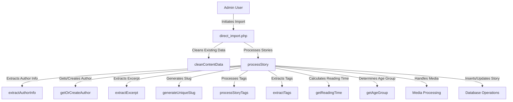
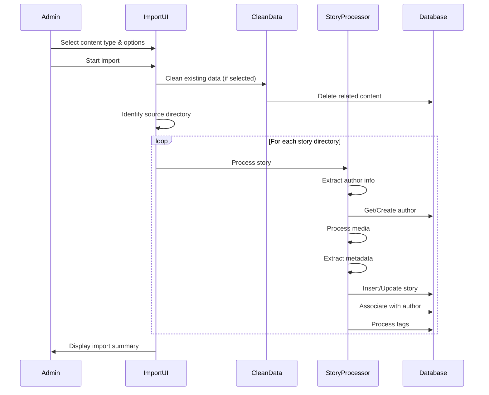

# Stories From The Web - Import System Documentation

## Overview

This document provides a comprehensive explanation of the import system used in the Stories From The Web platform. The import system is responsible for migrating content from a WordPress export into the custom database structure of the Stories platform.

## Table of Contents

1. [Import System Architecture](#import-system-architecture)
2. [Data Sources](#data-sources)
   - [WordPress Export XML](#wordpress-export-xml)
   - [Markdown Files Structure](#markdown-files-structure)
3. [Import Process Flow](#import-process-flow)
4. [Key Components](#key-components)
   - [Content Cleaning](#content-cleaning)
   - [Author Extraction and Management](#author-extraction-and-management)
   - [Story Processing](#story-processing)
   - [Tag Management](#tag-management)
   - [Media Handling](#media-handling)
5. [Database Operations](#database-operations)
6. [Error Handling](#error-handling)
7. [User Interface](#user-interface)
8. [Future Improvements](#future-improvements)

## Import System Architecture

The import system is built around a PHP-based web interface (`direct_import.php`) that provides administrators with a tool to import content from WordPress exports into the Stories platform. The system follows a modular approach with specialized functions for different aspects of the import process.



## Data Sources

### WordPress Export XML

The system uses a WordPress export file (`export.xml`) which contains all the content from the original WordPress site. This XML file follows the WordPress eXtended RSS (WXR) format and includes:

- Posts and pages
- Custom post types (like `childrens-story`)
- Categories and tags
- Authors
- Comments
- Media attachments
- Custom taxonomies and metadata

The export.xml file serves as a reference but is not directly used by the import script. Instead, the content has been pre-processed into markdown files.

### Markdown Files Structure

The primary source for the import process is a directory structure containing markdown files and associated media:

```
_wp migration/
├── export.xml
├── package.json
├── package-lock.json
├── uploads/
└── wp-md/
    ├── custom/
    │   ├── childrens-story/
    │   │   ├── a-windy-day-by-dearbhla-aged-9-from-northern-ireland/
    │   │   │   ├── index.md
    │   │   │   └── images/
    │   │   │       └── whimsical-wind-playful-girl.png
    │   │   ├── autumn-poem-by-niall-aged-9-from-omagh-northern-ireland-co-tyrone/
    │   │   └── ...
    │   ├── book/
    │   ├── featured-content/
    │   └── ...
    └── pages/
```

Each story is contained in its own directory with:
- An `index.md` file containing the story content with front matter
- An `images/` directory containing any associated images

The markdown files follow a structured format:

```markdown
---
title: "A Windy Day by Dearbhla, aged 9, from Northern Ireland"
date: 2023-07-18
coverImage: "whimsical-wind-playful-girl.png"
---

## Author

**Name:** Dearbhla

**Age:** 9

**Location:** Northern Ireland

## Summary

On a windy day, a little girl experiences the swirling leaves and the howling wind, bringing the world to life around her.

## Story

It's a windy day, So I go out to play. In the garden the leaves are scattered, And the trees bow down battered...
```

## Import Process Flow

The import process follows these steps:

1. **Initialization**: The admin selects content type, source type, and whether to clean existing data
2. **Data Cleaning**: If selected, existing data for the specified content type is removed
3. **Directory Identification**: The system locates the appropriate directory containing markdown files
4. **Content Processing**: For each story directory:
   - Read the markdown file
   - Extract front matter and content
   - Extract author information from the title
   - Process or create the author
   - Handle cover images
   - Extract excerpt
   - Generate a unique slug
   - Calculate reading time
   - Determine age group
   - Extract tags
   - Check if the story already exists
   - Insert or update the story in the database
   - Associate the story with the author
   - Process tags for the story
5. **Reporting**: Display summary statistics of the import process



## Key Components

### Content Cleaning

The `cleanContentData()` function is responsible for removing existing content before importing new data. This ensures that there are no duplicates or orphaned records. The function:

1. Takes parameters for content type and source type
2. Begins a database transaction for data integrity
3. Retrieves IDs of content to be deleted
4. Deletes associations (tags, authors)
5. Deletes the content items
6. Deletes unused authors
7. Deletes associated media files
8. Commits the transaction

The cleaning process is selective, only removing content that matches the specified content type and source type, preserving other content in the database.

### Author Extraction and Management

Author information is extracted from story titles using regex patterns. The system looks for patterns like:
- "Story Title by Author Name aged X from Location"
- "Story Title - Author, aged X, from Location"

The `extractAuthorInfo()` function uses multiple regex patterns to handle different title formats and extracts:
- Author name
- Author age
- Author location

The `getOrCreateAuthor()` function then:
1. Checks if the author already exists (by name or slug)
2. If found, updates the author's information
3. If not found, creates a new author record
4. Returns the author ID for association with the story

### Story Processing

The `processStory()` function is the core of the import system, handling the entire process for a single story:

1. Reads the markdown file
2. Extracts front matter and content
3. Calls other specialized functions for author extraction, excerpt creation, etc.
4. Processes cover images
5. Checks if the story already exists
6. Updates existing stories or inserts new ones
7. Associates the story with its author
8. Processes tags for the story

The function uses database transactions to ensure data integrity, with rollback capabilities in case of errors.

### Tag Management

Tags are extracted from:
1. Front matter (if available)
2. Content analysis (if no tags in front matter)

The `extractTags()` function analyzes the content for common themes and keywords if no tags are provided in the front matter. It normalizes tags by converting to lowercase and removing special characters.

The `processStoryTags()` function:
1. Deletes existing tag associations for the story
2. For each tag:
   - Checks if the tag exists
   - Creates the tag if it doesn't exist
   - Associates the tag with the story

### Media Handling

The import system handles media files by:
1. Looking for images in the story directory
2. Using the first image as the cover image
3. Copying the image to the uploads directory
4. Storing the image path in the database

If no images are found, a default cover image is used.

## Database Operations

The import system interacts with several database tables:

- `stories`: Stores the main story content
- `authors`: Stores author information
- `story_authors`: Junction table linking stories to authors
- `tags`: Stores tag information
- `story_tags`: Junction table linking stories to tags
- `media`: Stores media file information

Database operations are wrapped in transactions to ensure data integrity. If an error occurs during the import of a story, the transaction is rolled back to prevent partial imports.

## Error Handling

The import system includes comprehensive error handling:

1. Each function includes try-catch blocks to handle exceptions
2. Database transactions are used to ensure data integrity
3. Detailed error messages are displayed to the administrator
4. The system continues processing other stories if one fails

## User Interface

The import system provides a web-based user interface that allows administrators to:

1. Select the content type to import (stories, retail stories, games, artwork)
2. Select the source type (child, retail, scraped)
3. Choose whether to clean existing data before import
4. View real-time progress and logs during the import process
5. See a summary of the import results

## Future Improvements

Potential improvements to the import system could include:

1. Batch processing for better performance with large imports
2. More sophisticated content analysis for better tag extraction
3. Enhanced error recovery mechanisms
4. Support for additional content types
5. Improved media handling with image optimization
6. Better duplicate detection and handling
7. Import scheduling for large datasets