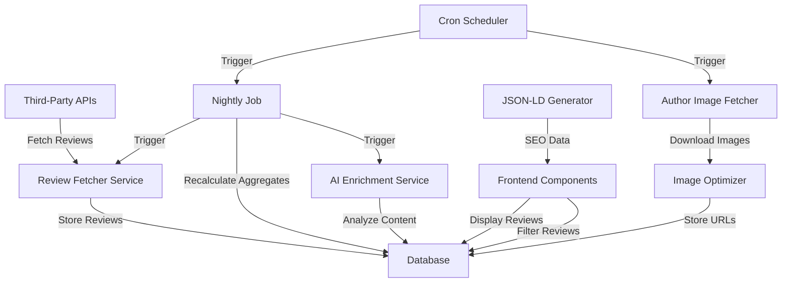
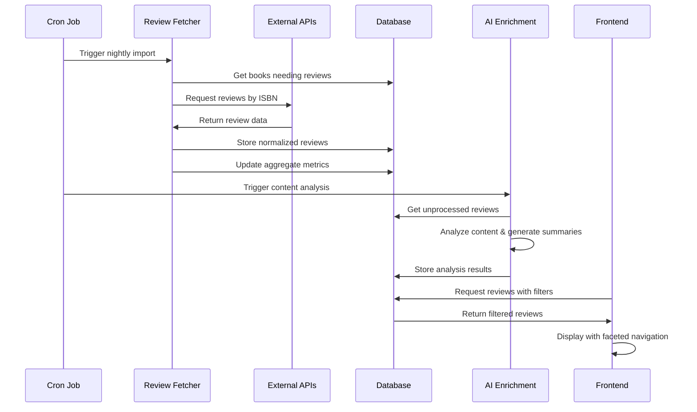

# Book Reviews System Architecture

## Background

We're building a reviews powerhouse for our children's book directory to make every book feel thoroughly vetted, easy to explore, and utterly trustworthy. The system combines our own in-house reviews with third-party sources, normalizing ratings from different scales (4.2/5, 8/10, 85%) into a standardized format for easy comparison.

The system stores individual reviews in a dedicated table while maintaining aggregate metrics (review count, average rating) on each book record for performance. Additionally, we're implementing AI-powered content analysis to generate age suitability reports and flag potentially inappropriate content for young readers.

## Goals

1. Create a unified reviews system that combines in-house and third-party reviews
2. Normalize ratings across different scales for easy comparison
3. Provide aggregate metrics for each book
4. Implement AI analysis for content suitability and age recommendations
5. Generate structured data for SEO
6. Create a user-friendly interface with faceted filtering
7. Automate the entire pipeline with nightly jobs

## Database Structure

### Main Tables

#### `reviews` Table
Stores individual book reviews with normalized ratings and AI-enriched content.

| Field | Type | Description |
|-------|------|-------------|
| id | int | Primary key |
| book_id | int | Foreign key to directory_items |
| source_id | int | Foreign key to review_sources |
| reviewer_name | varchar(255) | Name of the reviewer |
| reviewer_age | tinyint | Age of the reviewer (if available) |
| review_date | date | Date of the review |
| original_rating | varchar(50) | Original rating format (e.g., "4/5") |
| rating_value | decimal(10,2) | Numeric rating value |
| rating_scale | decimal(10,2) | Maximum possible rating |
| rating_normalised | decimal(3,2) | Normalized rating (0-1 scale) |
| review_text | text | The review content |
| metadata | json | Additional metadata |
| ai_summary | text | AI-generated summary of the review |
| suitability_score | decimal(3,2) | AI-determined age suitability (0-1) |
| content_flags | json | Array of content warnings |
| created_at | timestamp | Creation timestamp |
| updated_at | timestamp | Last update timestamp |

#### `review_sources` Table
Tracks different sources of reviews (both internal and third-party).

| Field | Type | Description |
|-------|------|-------------|
| id | int | Primary key |
| name | varchar(255) | Name of the review source |
| url | varchar(255) | URL of the source |
| is_third_party | tinyint(1) | Whether this is a third-party source |
| created_at | timestamp | Creation timestamp |
| updated_at | timestamp | Last update timestamp |

#### `directory_items` Table (Books)
Contains books with aggregate review metrics.

| Field | Type | Description |
|-------|------|-------------|
| id | int | Primary key |
| title | varchar(255) | Book title |
| ... | ... | Other book fields |
| review_count | int | Number of reviews |
| average_rating | decimal(3,2) | Average normalized rating (0-1) |
| highest_rating | decimal(3,2) | Highest normalized rating (0-1) |
| lowest_rating | decimal(3,2) | Lowest normalized rating (0-1) |
| ai_summary | text | AI-generated summary of all reviews |
| suitability_score | decimal(3,2) | Overall age suitability score (0-1) |
| content_flags | json | Combined content warnings |

## System Components

### 1. Third-Party Review Fetcher

A modular service that fetches reviews from external APIs and websites.

**Files:**
- `stories-backend/services/ReviewFetcher/ReviewFetcherInterface.php`
- `stories-backend/services/ReviewFetcher/GoogleBooksReviewFetcher.php`
- `stories-backend/services/ReviewFetcher/OpenLibraryReviewFetcher.php`
- `stories-backend/services/ReviewFetcher/AmazonReviewFetcher.php`
- `stories-backend/services/ReviewFetcher/GoodreadsReviewFetcher.php`
- `stories-backend/services/ReviewFetcher/KirkusReviewsFetcher.php`
- `stories-backend/services/ReviewFetcher/SLJReviewFetcher.php`
- `stories-backend/services/ReviewFetcher/StoriesReviewFetcher.php`

**Functionality:**
- Fetch reviews by ISBN from multiple sources
- Match books to our database
- Normalize ratings to our standard scale
- Handle different API formats and response structures

**API Integrations:**
- **Google Books API**: Fetches book data and ratings via `https://www.googleapis.com/books/v1/volumes?q=isbn:{ISBN}`
- **Open Library API**: Retrieves book metadata via `https://openlibrary.org/api/books?bibkeys=ISBN:{ISBN}&format=json&jscmd=data`
- **Internet Archive API**: Gets reviews for books with Open Library IDs
- **Web Scraping**: For sources without APIs (Amazon, Goodreads, Kirkus, SLJ) using advanced anti-detection techniques

```php
// Example interface
interface ReviewFetcherInterface {
    public function fetchReviewsByISBN(string $isbn): array;
    public function matchBookToDatabase(array $bookData): ?int;
}
```

### 2. Nightly Import Job

A command-line script that runs the fetchers and updates the database.

**Files:**
- `stories-backend/bin/update_reviews.php`

**Functionality:**
- Get books that need reviews (new or outdated)
- Try each fetcher for each book
- Import new reviews
- Update aggregate values
- Log results

```php
// Example usage
php stories-backend/bin/update_reviews.php --limit=100
```

### 3. AI Enrichment Service

A service that analyzes review content for age suitability and content flags.

**Files:**
- `stories-backend/services/AI/ReviewAnalyzer.php`
- `stories-backend/bin/enrich_reviews.php`

**Functionality:**
- Analyze review text for age suitability
- Identify content flags (violence, language, mature themes, etc.)
- Generate concise summaries
- Create overall book suitability reports

```php
// Example usage
php stories-backend/bin/enrich_reviews.php --batch=50
```

### 4. Enhanced Frontend Components

Updated UI components for displaying reviews with filtering options.

**Files:**
- `src/components/EnhancedReviewSection.astro`
- `src/pages/reviews/[slug].astro`
- `src/pages/reviews/index.astro`

**Functionality:**
- Display reviews grouped by source
- Provide faceted filters (rating, age, source type, content flags)
- Show AI-generated summaries and content warnings
- Support pagination for large review sets

### 5. JSON-LD Generator

Component for generating structured data for SEO.

**Files:**
- `src/components/ReviewJsonLd.astro`

**Functionality:**
- Generate schema.org Book and Review markup
- Include aggregate ratings
- Format individual reviews for rich snippets
- Improve search engine visibility

### 6. Author Image Fetcher

Service for fetching and optimizing author images.

**Files:**
- `stories-backend/services/AuthorImageFetcher.php`
- `stories-backend/bin/fetch_author_images.php`

**Functionality:**
- Search for author images from multiple sources
- Download and optimize images
- Update author records with image URLs

### 7. Cron Job Scheduler

Configuration for automating the entire pipeline.

**Files:**
- `stories-backend/config/cron.conf`

**Functionality:**
- Schedule nightly review imports
- Schedule AI enrichment
- Schedule author image fetching
- Schedule aggregate recalculation

## Implementation Plan

### Phase 1: Third-Party Review Fetcher ✅
- Implement the fetcher interface ✅
- Create Google Books API integration ✅
- Create Open Library API integration ✅
- Create Amazon review scraper ✅
- Create Goodreads review scraper ✅
- Add matching logic for ISBNs and titles ✅

### Phase 2: Admin Interface for Reviews ✅
- Create Reviews tab in Book Import Tool ✅
- Implement pagination for books and reviews ✅
- Add filtering options for reviews ✅
- Add bulk actions for reviews ✅
- Create review edit form ✅
- Add review deletion functionality ✅

### Phase 3: Review Scraping Process ✅
- Create book-import-scrape.php script ✅
- Implement duplicate detection ✅
- Add logging and error handling ✅
- Add progress tracking ✅
- Test with real books ✅
- Improve Amazon review scraping with enhanced CAPTCHA detection ✅
- Update HTML parsing patterns for current Amazon structure ✅
- Implement robust request throttling and user agent rotation ✅
- Optimize Amazon review scraper for cPanel environment ✅

### Phase 4: AI Enrichment
- Set up OpenAI integration ✅
- Implement content analysis ✅
- Create summary generation ✅
- Build the age suitability report ✅
- Add AI analysis to review management ✅

### Phase 5: Frontend Updates
- Enhance the ReviewSection component
- Implement faceted filters
- Add AI summary display
- Create detailed review pages

### Phase 6: JSON-LD and SEO
- Create the ReviewJsonLd component
- Implement on book detail pages
- Test with Google's structured data testing tool

### Phase 7: Author Images
- Implement the AuthorImageFetcher service
- Create the image optimization pipeline
- Update author records

### Phase 8: Cron Jobs
- Configure all scheduled tasks
- Set up logging and monitoring
- Test the entire pipeline

## Existing Code

The system builds upon the existing review migration script:

- `stories-backend/public/migrate_reviews.php`: Imports legacy reviews from markdown files, normalizes ratings, and updates aggregate values.

Key functions in this script:

1. `migrateReviews($db)`: Main function that processes review files and imports them
2. `extractReviewsFromMarkdown($content)`: Parses review data from markdown content
3. `updateBookAggregateValues($db, $bookId)`: Updates aggregate metrics for a book

The normalization formula used is:
```php
$rating_normalised = $rating_value / $rating_scale
```

This ensures all ratings are on a 0-1 scale regardless of the original scale.

## API Endpoints

### Current Endpoints
- `stories-backend/api/v1/submit-review.php`: Handles review submissions (currently incomplete)

### New Endpoints to Create
- `stories-backend/api/v1/reviews.php`: Get reviews for a book
- `stories-backend/api/v1/reviews/search.php`: Search reviews with filters
- `stories-backend/api/v1/reviews/stats.php`: Get aggregate statistics

## Diagrams

### System Architecture



### Data Flow



## Review Scraping Journey and Challenges

Our journey to build a robust review scraping system has involved multiple approaches and iterations as we've encountered increasingly sophisticated anti-scraping measures from major platforms.

### Evolution of Our Scraping Approach

#### Phase 1: Direct PHP Scraping (Limited Success)
Initially, we implemented direct PHP-based scraping using cURL:
- Simple HTTP requests with randomized user agents
- Basic regex pattern matching for HTML parsing
- Worked initially but quickly encountered limitations

#### Phase 2: Enhanced PHP Scraping with Anti-Detection (Partial Success)
We improved our approach with:
- Sophisticated user agent rotation
- Cookie persistence
- Delayed requests with randomization
- Multiple fallback strategies
- This worked for a while but eventually hit roadblocks

#### Phase 3: Netlify Serverless Functions with Puppeteer (Mixed Results)
To overcome limitations, we implemented:
- Serverless functions on Netlify using Puppeteer
- Browser automation to handle JavaScript-rendered content
- Worked better for Goodreads but still faced issues:
  - 250MB size limit for Netlify functions (Puppeteer is large)
  - Execution time limits
  - Amazon's forced login walls
  - Goodreads' "Show more reviews" JavaScript buttons

#### Phase 4: Third-Party API Services (Outscraper) (Limited Success)
We tried using Outscraper's API:
- Implemented with API key: `NTNjYjkxMTUwOWI3NDBlYzg2MmI5NzY2ZTYxNDYxMTl8ZmVjODc2ZDI5ZA`
- Initially worked for some Goodreads scraping
- Limited results (typically only 30 reviews per book)
- No official Amazon endpoint despite claims

### Current Challenges

#### Amazon Challenges
- **Forced Login Walls**: Amazon now redirects to login pages for most review access attempts
- **CAPTCHA Detection**: Sophisticated bot detection triggers CAPTCHAs frequently
- **Dynamic HTML Structure**: Frequent changes to page structure break regex patterns
- **IP Blocking**: Repeated requests from the same IP get blocked

#### Goodreads Challenges
- **JavaScript Pagination**: "Show more reviews" buttons require JavaScript execution
- **Limited Initial Load**: Only 10-30 reviews load in the initial HTML
- **Dynamic Content**: Modern React-based interface makes scraping difficult
- **Inconsistent HTML Structure**: Multiple page layouts require different parsing strategies

### VPS-Based Solution Plan

After evaluating all options, we've determined that a dedicated VPS running Puppeteer/Playwright is the most effective solution:

#### 1. VPS Setup (Hetzner Cloud Recommended)
- 4GB RAM, 2 vCPU, 40GB SSD (~$10/month)
- Ubuntu 22.04 LTS
- Node.js 18.x LTS
- PM2 for process management
- Full Puppeteer installation with Chrome

#### 2. Scraper Architecture
- Dedicated Node.js application with:
  - Express API server for PHP backend integration
  - Puppeteer for browser automation
  - Database connection for caching results
  - Robust logging and error handling
  - Proxy rotation capability

#### 3. Key Features
- **Browser Fingerprint Randomization**: Realistic browser profiles
- **Session Management**: Persistent sessions to avoid login walls
- **JavaScript Execution**: Ability to click "Show more" buttons
- **Proxy Integration**: Option to rotate IPs if needed
- **Caching Layer**: Store results to minimize scraping frequency
- **Rate Limiting**: Self-throttling to avoid detection
- **Fallback Mechanisms**: Multiple strategies for each source

#### 4. Integration with PHP Backend
- Simple REST API endpoints:
  - `/scrape/goodreads?url=<url>&limit=<limit>`
  - `/scrape/amazon?asin=<asin>&limit=<limit>`
- JSON response format matching existing review structure
- Authentication to prevent unauthorized access
- Detailed error reporting

#### 5. Deployment and Monitoring
- Automated deployment with Git
- PM2 for process monitoring and auto-restart
- Logging to files with rotation
- Regular backups of cached data
- Health check endpoint for monitoring

This VPS-based approach provides several advantages:
- No serverless function size/time limits
- Full control over the environment
- Ability to run a complete browser instance
- Persistent sessions between requests
- Cost-effective compared to commercial scraping services

## Advanced Web Scraping Techniques

The system employs sophisticated web scraping techniques to extract reviews from sources that don't provide public APIs. These techniques include:

### 1. Enhanced CAPTCHA Detection

The review scrapers include comprehensive CAPTCHA and anti-bot detection:

- Multiple pattern matching for various CAPTCHA and security challenge pages
- Detection of login redirects and handling of partial data extraction
- Identification of unusual response patterns (small responses, unexpected content)
- Saving of CAPTCHA pages for debugging and analysis

### 2. Request Throttling and Randomization

To avoid triggering anti-scraping measures:

- Variable delays between requests (2-5 seconds for Amazon, 1-3 seconds for other sources)
- Random jitter added to delays to create non-predictable patterns
- Occasional longer pauses (3-8 seconds) to simulate human behavior
- Different delay patterns for different sites based on their anti-scraping sensitivity

### 3. Browser Fingerprint Randomization

Each request uses different browser fingerprints:

- Rotation among 14+ modern user agent strings (desktop and mobile)
- Randomized HTTP header ordering
- Unique cookie files for each request to prevent tracking
- Varied referrer and connection settings

### 4. Robust HTML Parsing

The system uses multiple pattern-matching approaches for each data element:

- Multiple regex patterns for review blocks to handle different page layouts
- Alternative patterns for extracting reviewer names, ratings, dates, and text
- Fallback to aggregate ratings when individual reviews can't be accessed
- Detailed logging of parsing results for debugging

### 5. Error Handling and Recovery

Sophisticated error handling ensures maximum data extraction:

- Retry logic with increasing delays for temporary failures
- Graceful degradation to return partial data when complete scraping fails
- Preservation of already-collected reviews when pagination is interrupted
- Comprehensive logging for debugging and improvement

### 6. Puppeteer Browser Automation

For sites with JavaScript-heavy interfaces like Goodreads:

- Full browser automation with Puppeteer
- Ability to interact with dynamic elements (click buttons, scroll pages)
- Wait for network requests to complete
- Extract content after JavaScript rendering
- Handle login flows if necessary
- Simulate realistic user behavior

These techniques allow the system to reliably extract review data even from sources with strong anti-scraping measures, while being respectful of the source websites by limiting request frequency and volume.

## Conclusion

This architecture provides a comprehensive solution for building a reviews powerhouse that combines in-house and third-party reviews, normalizes ratings, and enriches content with AI analysis. The system is designed to be modular, scalable, and automated, ensuring that book reviews are always up-to-date and valuable for users.

By implementing this system, we'll create a trusted resource for parents, teachers, and young readers to find age-appropriate books with confidence.

## Age-Related Content Detection

Unlike general book review platforms like Amazon, our system specifically focuses on identifying age-appropriateness information from reviews. Here's how it works:

### Smart Pattern Recognition

When scraping reviews, the system looks for specific patterns indicating age-related content:

- Explicit age recommendations: "perfect for ages 8-10", "too mature for children under 12"
- School grade references: "great for 3rd graders", "middle school readers"
- Content appropriateness mentions: "contains scary scenes", "mild language"
- Comparative references: "similar to Harry Potter but for younger readers"

### AI Content Analysis

The AI enrichment service analyzes the full text of each review to:

1. **Identify explicit age recommendations** using various phrasing patterns
2. **Detect implicit age indicators** like vocabulary complexity or thematic elements
3. **Recognize content warnings** that parents might care about
4. **Understand contextual appropriateness** of potentially concerning content

For example, when analyzing a review that mentions "some scary scenes," the AI will assess:
- How central these scenes are to the story
- The intensity level described by reviewers
- Whether reviewers mention children being frightened
- If the scary elements are balanced by positive themes

### Reviewer Context Prioritization

The system gives higher weight to:
- Reviews from verified parents or educators
- Reviews that mention the reviewer's child's age and reaction
- Reviews from child readers who provide their age
- Reviews that give specific examples of content rather than general statements

## What Makes Our System Unique

### Age-First Organization

Unlike Amazon's recency or helpfulness sorting, our system:
- Organizes reviews by age relevance
- Extracts and highlights age-specific information often buried in general reviews
- Creates standardized age ranges from inconsistent mentions
- Groups similar age recommendations to show consensus

### Parent-Focused Content Flags

We systematically identify and categorize content elements that matter to parents:

| Content Type | Categories | Example |
|--------------|------------|---------|
| Violence | None, Cartoon, Mild, Moderate, Intense | "Cartoon-style slapstick violence with no injuries" |
| Scary Content | None, Mild Suspense, Moderately Scary, Frightening | "Some children found the forest scenes frightening" |
| Mature Themes | None, Mild, Moderate, Significant | "Deals with parental separation in a sensitive way" |
| Language | None, Mild, Moderate, Strong | "Contains a few instances of mild language" |
| Educational Value | High, Moderate, Limited, Entertainment-focused | "Teaches problem-solving while entertaining" |

### AI-Generated Suitability Reports

The system synthesizes all reviews to create comprehensive reports that:
- Explain WHY a book is appropriate for certain ages, not just stating an age range
- Provide context about potentially concerning content for informed decisions
- Balance content warnings with educational or thematic value
- Offer guidance for different reading contexts (independent vs. parent-guided)

### Example Workflow

1. The nightly job identifies "Harry Potter and the Philosopher's Stone" for review collection
2. The system fetches reviews from Google Books, Open Library, and other sources
3. During import, the AI identifies age-related comments:
   - "Perfect for confident readers aged 8+"
   - "Some scary scenes might frighten children under 7"
   - "My 9-year-old loved it but found some parts scary"
   - "Great for reading with 6-7 year olds, independent reading for 8+"

4. The AI analyzes the full text and identifies content elements:
   - Fantasy violence (mild to moderate)
   - Scary scenes (moderate)
   - Death of parents (mentioned but not graphic)
   - Positive themes of friendship and courage

5. The system generates an Age Suitability Report:
   - "Best suited for ages 8-12 as independent reading"
   - "Appropriate for ages 6-7 with parental guidance"
   - "Contains mild fantasy violence and some scary scenes that sensitive children might find frightening"
   - "Positive themes of friendship, courage, and standing up to bullies make this a valuable read despite some scary content"

This approach provides much more nuanced and useful information than typical review platforms, focusing specifically on what parents and educators need to know about age appropriateness.

## Code Examples for Implementation

### 1. Review Fetcher Interface

```php
// stories-backend/services/ReviewFetcher/ReviewFetcherInterface.php
<?php

namespace Services\ReviewFetcher;

interface ReviewFetcherInterface {
    /**
     * Fetch reviews for a book by ISBN
     *
     * @param string $isbn The ISBN of the book
     * @return array Array of review data
     */
    public function fetchReviewsByISBN(string $isbn): array;

    /**
     * Match book data from an external source to our database
     *
     * @param array $bookData Book data from external source
     * @return int|null Book ID if found, null otherwise
     */
    public function matchBookToDatabase(array $bookData): ?int;
}
```

### 2. Google Books API Implementation

```php
// stories-backend/services/ReviewFetcher/GoogleBooksReviewFetcher.php
<?php

namespace Services\ReviewFetcher;

class GoogleBooksReviewFetcher implements ReviewFetcherInterface {
    private $apiKey;
    private $db;

    public function __construct(\PDO $db, string $apiKey) {
        $this->db = $db;
        $this->apiKey = $apiKey;
    }

    public function fetchReviewsByISBN(string $isbn): array {
        // Fetch from Google Books API
        $url = "https://www.googleapis.com/books/v1/volumes?q=isbn:{$isbn}&key={$this->apiKey}";
        $response = json_decode(file_get_contents($url), true);

        $reviews = [];
        if (!empty($response['items'])) {
            $bookData = $response['items'][0]['volumeInfo'];

            // Extract ratings information
            if (isset($bookData['averageRating']) && isset($bookData['ratingsCount'])) {
                $averageRating = $bookData['averageRating'];
                $ratingsCount = $bookData['ratingsCount'];

                // Create a synthetic review representing the aggregate
                $reviews[] = [
                    'source_id' => 2, // Google Books source ID
                    'reviewer_name' => 'Google Books Aggregate',
                    'reviewer_age' => null,
                    'review_date' => date('Y-m-d'),
                    'original_rating' => "{$averageRating}/5",
                    'rating_value' => $averageRating,
                    'rating_scale' => 5,
                    'rating_normalised' => $averageRating / 5,
                    'review_text' => "Aggregate rating from {$ratingsCount} Google Books users.",
                    'metadata' => json_encode([
                        'ratings_count' => $ratingsCount,
                        'book_info' => [
                            'title' => $bookData['title'] ?? '',
                            'authors' => $bookData['authors'] ?? [],
                            'publisher' => $bookData['publisher'] ?? '',
                            'published_date' => $bookData['publishedDate'] ?? '',
                        ]
                    ])
                ];
            }

            // Extract textual reviews if available
            if (isset($bookData['reviews'])) {
                foreach ($bookData['reviews'] as $review) {
                    $reviews[] = [
                        'source_id' => 2, // Google Books source ID
                        'reviewer_name' => $review['author'] ?? 'Anonymous',
                        'reviewer_age' => null,
                        'review_date' => $review['date'] ?? date('Y-m-d'),
                        'original_rating' => isset($review['rating']) ? "{$review['rating']}/5" : null,
                        'rating_value' => $review['rating'] ?? null,
                        'rating_scale' => 5,
                        'rating_normalised' => isset($review['rating']) ? $review['rating'] / 5 : null,
                        'review_text' => $review['text'] ?? '',
                        'metadata' => json_encode([
                            'review_id' => $review['id'] ?? null,
                            'review_url' => $review['url'] ?? null
                        ])
                    ];
                }
            }
        }

        return $reviews;
    }

    public function matchBookToDatabase(array $bookData): ?int {
        // Match by ISBN
        if (!empty($bookData['industryIdentifiers'])) {
            foreach ($bookData['industryIdentifiers'] as $identifier) {
                if ($identifier['type'] === 'ISBN_13' || $identifier['type'] === 'ISBN_10') {
                    $isbn = $identifier['identifier'];
                    $stmt = $this->db->prepare("
                        SELECT id FROM directory_items
                        WHERE (isbn = ? OR isbn13 = ?) AND type = 'book'
                    ");
                    $stmt->execute([$isbn, $isbn]);
                    $result = $stmt->fetch(\PDO::FETCH_ASSOC);

                    if ($result) {
                        return $result['id'];
                    }
                }
            }
        }

        // Match by title and author
        if (!empty($bookData['title']) && !empty($bookData['authors'][0])) {
            $title = $bookData['title'];
            $author = $bookData['authors'][0];

            $stmt = $this->db->prepare("
                SELECT di.id
                FROM directory_items di
                JOIN authors a ON di.author_id = a.id
                WHERE di.title LIKE ? AND a.name LIKE ? AND di.type = 'book'
            ");
            $stmt->execute(["%{$title}%", "%{$author}%"]);
            $result = $stmt->fetch(\PDO::FETCH_ASSOC);

            if ($result) {
                return $result['id'];
            }
        }

        return null;
    }
}
```

### 3. AI Review Analyzer

```php
// stories-backend/services/AI/ReviewAnalyzer.php
<?php

namespace Services\AI;

class ReviewAnalyzer {
    private $openaiClient;
    private $db;

    public function __construct(\PDO $db, $openaiApiKey) {
        $this->db = $db;
        $this->openaiClient = new \OpenAI\Client($openaiApiKey);
    }

    public function analyzeReview(int $reviewId): array {
        // Get the review
        $stmt = $this->db->prepare("SELECT * FROM reviews WHERE id = ?");
        $stmt->execute([$reviewId]);
        $review = $stmt->fetch(\PDO::FETCH_ASSOC);

        if (!$review) {
            throw new \Exception("Review not found");
        }

        // Analyze for age suitability and content flags
        $analysis = $this->performContentAnalysis($review['review_text']);

        // Generate AI summary
        $summary = $this->generateSummary($review['review_text']);

        // Update the review with the analysis results
        $stmt = $this->db->prepare("
            UPDATE reviews
            SET
                ai_summary = ?,
                suitability_score = ?,
                content_flags = ?,
                metadata = JSON_SET(COALESCE(metadata, '{}'), '$.ai_analysis', ?)
            WHERE id = ?
        ");

        $contentFlagsJson = json_encode($analysis['content_flags']);
        $analysisJson = json_encode($analysis);

        $stmt->execute([
            $summary,
            $analysis['suitability_score'],
            $contentFlagsJson,
            $analysisJson,
            $reviewId
        ]);

        return [
            'review_id' => $reviewId,
            'summary' => $summary,
            'analysis' => $analysis
        ];
    }

    private function performContentAnalysis(string $text): array {
        // Use OpenAI to analyze the text
        $prompt = "Analyze the following book review for age suitability and content flags.
                  Identify any language or themes that might be unsuitable for young readers.
                  Assign a suitability score from 0 to 10, where 10 is completely suitable for all ages.
                  List any content flags such as: violence, scary content, mature themes, harsh language, etc.

                  Review text: {$text}

                  Format your response as JSON with the following structure:
                  {
                    \"suitability_score\": number,
                    \"content_flags\": [string],
                    \"reasoning\": string
                  }";

        $response = $this->openaiClient->chat()->create([
            'model' => 'gpt-4o',
            'messages' => [
                ['role' => 'system', 'content' => 'You are an AI assistant that analyzes book reviews for age suitability.'],
                ['role' => 'user', 'content' => $prompt]
            ],
            'response_format' => ['type' => 'json_object']
        ]);

        return json_decode($response->choices[0]->message->content, true);
    }

    private function generateSummary(string $text): string {
        // Use OpenAI to generate a concise summary
        $prompt = "Summarize the following book review in a concise, helpful way that captures the key points and sentiment:

                  {$text}

                  Keep the summary under 100 words.";

        $response = $this->openaiClient->chat()->create([
            'model' => 'gpt-4o',
            'messages' => [
                ['role' => 'system', 'content' => 'You are an AI assistant that summarizes book reviews.'],
                ['role' => 'user', 'content' => $prompt]
            ]
        ]);

        return trim($response->choices[0]->message->content);
    }
}
```

### 4. Nightly Import Job

```php
// stories-backend/bin/update_reviews.php
#!/usr/bin/env php
<?php

require_once __DIR__ . '/../admin/includes/db-connect.php';
require_once __DIR__ . '/../services/ReviewFetcher/ReviewFetcherInterface.php';
require_once __DIR__ . '/../services/ReviewFetcher/GoogleBooksReviewFetcher.php';
require_once __DIR__ . '/../services/ReviewFetcher/OpenLibraryReviewFetcher.php';

// Configure fetchers
$fetchers = [
    new \Services\ReviewFetcher\GoogleBooksReviewFetcher($db, getenv('GOOGLE_BOOKS_API_KEY')),
    new \Services\ReviewFetcher\OpenLibraryReviewFetcher($db)
];

// Get books that need reviews
$stmt = $db->prepare("
    SELECT id, isbn, isbn13, title
    FROM directory_items
    WHERE type = 'book'
    AND (
        review_count = 0
        OR updated_at < DATE_SUB(NOW(), INTERVAL 7 DAY)
    )
    LIMIT 50
");
$stmt->execute();
$books = $stmt->fetchAll(PDO::FETCH_ASSOC);

$reviewsImported = 0;
$booksUpdated = 0;

foreach ($books as $book) {
    echo "Processing book: {$book['title']} (ID: {$book['id']})\n";

    // Try each ISBN
    $isbns = array_filter([$book['isbn13'], $book['isbn']]);

    if (empty($isbns)) {
        echo "  No ISBN available, skipping\n";
        continue;
    }

    foreach ($isbns as $isbn) {
        echo "  Trying ISBN: $isbn\n";

        // Try each fetcher
        foreach ($fetchers as $fetcher) {
            $fetcherName = get_class($fetcher);
            echo "    Using fetcher: $fetcherName\n";

            try {
                $reviews = $fetcher->fetchReviewsByISBN($isbn);

                if (empty($reviews)) {
                    echo "    No reviews found\n";
                    continue;
                }

                echo "    Found " . count($reviews) . " reviews\n";

                // Import reviews
                foreach ($reviews as $review) {
                    // Check for duplicates
                    $checkStmt = $db->prepare("
                        SELECT id FROM reviews
                        WHERE book_id = ? AND source_id = ? AND reviewer_name = ?
                    ");
                    $checkStmt->execute([
                        $book['id'],
                        $review['source_id'],
                        $review['reviewer_name']
                    ]);

                    if ($checkStmt->fetch()) {
                        echo "    Skipping duplicate review by {$review['reviewer_name']}\n";
                        continue;
                    }

                    // Insert review
                    $insertStmt = $db->prepare("
                        INSERT INTO reviews (
                            book_id,
                            source_id,
                            reviewer_name,
                            reviewer_age,
                            review_date,
                            original_rating,
                            rating_value,
                            rating_scale,
                            rating_normalised,
                            review_text,
                            metadata
                        ) VALUES (
                            :book_id,
                            :source_id,
                            :reviewer_name,
                            :reviewer_age,
                            :review_date,
                            :original_rating,
                            :rating_value,
                            :rating_scale,
                            :rating_normalised,
                            :review_text,
                            :metadata
                        )
                    ");

                    $insertStmt->execute([
                        ':book_id' => $book['id'],
                        ':source_id' => $review['source_id'],
                        ':reviewer_name' => $review['reviewer_name'],
                        ':reviewer_age' => $review['reviewer_age'],
                        ':review_date' => $review['review_date'],
                        ':original_rating' => $review['original_rating'],
                        ':rating_value' => $review['rating_value'],
                        ':rating_scale' => $review['rating_scale'],
                        ':rating_normalised' => $review['rating_normalised'],
                        ':review_text' => $review['review_text'],
                        ':metadata' => $review['metadata']
                    ]);

                    $reviewsImported++;
                    echo "    Imported review by {$review['reviewer_name']}\n";
                }

                // Update aggregate values
                updateBookAggregateValues($db, $book['id']);
                $booksUpdated++;

                // Break after first successful fetcher
                break 2;
            } catch (Exception $e) {
                echo "    Error: " . $e->getMessage() . "\n";
            }
        }
    }
}

echo "Import complete. Imported {$reviewsImported} reviews for {$booksUpdated} books.\n";

// Function to update book aggregate values
function updateBookAggregateValues($db, $bookId) {
    // Get aggregate values
    $aggregateStmt = $db->prepare("
        SELECT
            COUNT(*) as review_count,
            AVG(rating_normalised) as average_rating,
            MAX(rating_normalised) as highest_rating,
            MIN(rating_normalised) as lowest_rating
        FROM reviews
        WHERE book_id = ? AND rating_normalised IS NOT NULL
    ");
    $aggregateStmt->execute([$bookId]);
    $aggregateValues = $aggregateStmt->fetch(PDO::FETCH_ASSOC);

    // Update the book
    if ($aggregateValues['review_count'] > 0) {
        $stmt = $db->prepare("
            UPDATE directory_items
            SET
                review_count = ?,
                average_rating = ?,
                highest_rating = ?,
                lowest_rating = ?
            WHERE id = ?
        ");

        $stmt->execute([
            $aggregateValues['review_count'],
            $aggregateValues['average_rating'],
            $aggregateValues['highest_rating'],
            $aggregateValues['lowest_rating'],
            $bookId
        ]);

        echo "  Updated aggregate values for book ID: $bookId\n";
    }
}
```

### 5. JSON-LD Generator

```php
// src/components/ReviewJsonLd.astro
---
const { book, reviews } = Astro.props;

// Calculate aggregate rating
const aggregateRating = {
    '@type': 'AggregateRating',
    'ratingValue': book.average_rating * 5, // Convert to 5-star scale
    'bestRating': '5',
    'worstRating': '1',
    'ratingCount': book.review_count
};

// Format individual reviews
const reviewItems = reviews.map(review => ({
    '@type': 'Review',
    'reviewRating': {
        '@type': 'Rating',
        'ratingValue': review.rating_normalised * 5, // Convert to 5-star scale
        'bestRating': '5',
        'worstRating': '1'
    },
    'author': {
        '@type': 'Person',
        'name': review.reviewer_name
    },
    'reviewBody': review.review_text
}));

// Create the JSON-LD data
const jsonLd = {
    '@context': 'https://schema.org',
    '@type': 'Book',
    'name': book.title,
    'author': {
        '@type': 'Person',
        'name': book.author
    },
    'isbn': book.isbn13 || book.isbn,
    'publisher': {
        '@type': 'Organization',
        'name': book.publisher
    },
    'aggregateRating': aggregateRating,
    'review': reviewItems
};
---

<script type="application/ld+json" set:html={JSON.stringify(jsonLd)}></script>
```